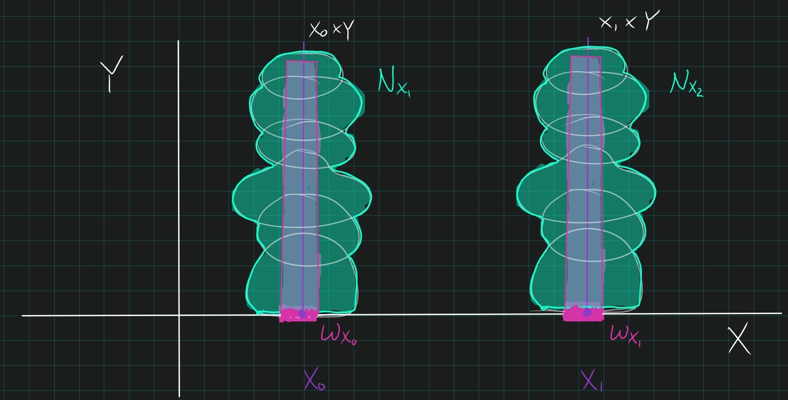

:::{.problem title="?"}
Show that for any two topological spaces $X$ and $Y$ , $X \cross Y$ is compact if and only if both $X$ and $Y$ are compact.

:::

:::{.concept}
\envlist
- Proof of the tube lemma: 
- Continuous image of compact is compact.
:::

:::{.strategy}
What's the picture?

Take an open cover of the product, use that vertical fibers are compact to get a finite cover for each fiber.
Use tube lemma to get opens in the base space, run over all $x$ so the tube bases cover $X$.
Use that $X$ is compact to get a finite subcover.

:::

:::{.solution}
\envlist

:::{.proof title="Using the tube lemma without proof"}
$\impliedby$:

- By the universal property, the product $X\cross Y$ is equipped with continuous projections $\pi_X: X\cross Y\to X$ and $\pi_Y: X\cross Y\to X$.
- The continuous image of a compact space is compact, and the images are all of $X$ and $Y$ respectively:
\[
\pi_1(X\cross Y) &= X \\
\pi_2(X\cross Y) &= Y
.\]

$\implies$:

- Let $\ts{U_j} \covers X\cross Y$ be an open cover.
- **Cover a fiber**: fix $x\in X$, the slice $x \cross Y$ is homeomorphic to $Y$ and thus compact 
- Cover it by finitely many elements $\theset{U_j}_{j\leq m} \covers {x} \cross Y$.
  
  > Really, cover $Y$, and then cross with $x$ to cover $x \cross Y$.

  - Set 
\[
N_x \da \Union_{j\leq m} U_j \supseteq x \cross Y
.\]
  - Apply the tube lemma to $N_x$: 
    - Produce a neighborhood $W_x$ of $x$ in $X$ where $W_x \subset N_x$ 
    - This yields a finite cover:
  \[
\ts{U_j}_{j\leq m}\covers N_x \cross Y \supset W_x \cross Y \implies \ts{U_j}_{j\leq m} \covers W_x\cross Y
  .\]
- **Cover the base**: let $x\in X$ vary: for each $x\in X$, produce $W_x \cross Y$ as above, then $\theset{W_x}_{x\in X} \covers X$ where each tube $W_x \cross Y$ is covered by *finitely* many $U_j$.
- Use that $X$ is compact to produce a finite subcover $\theset{W_k}_{k \leq M} \covers X$. 
- Then $\theset{W_k\cross Y}_{k\leq M} \covers X\cross Y$, this is a finite set since each fiber was covered by finitely many opens 
  - Finitely many $k$
  - For each $k$, the tube $W_k \cross Y$ is covered by finitely by $U_j$
  - And finite $\times$ finite = finite.
:::

:::

