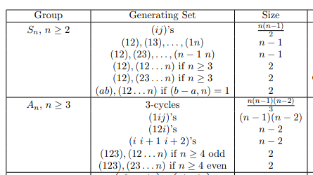

::: problem
- Show that $S_n$ is generated by any of the following types of cycles:

  

  - Show that $S_n$ is generated by transpositions.

  - Show that $S_n$ is generated by *adjacent* transpositions.

  - Show that $S_n$ is generated by $\theset{(12), (12\cdots n)}$ for $n\geq 2$

  - Show that $S_n$ is generated by $\theset{(12), (23\cdots n)}$ for $n\geq 3$

  - Show that $S_n$ is generated by $\theset{(ab), (12\cdots n)}$ where $1\leq a<b\leq n$ iff $\gcd(b-a, n) = 1$.

  - Show that $S_p$ is generated by any arbitrary transposition and any arbitrary $p\dash$cycle.
:::
