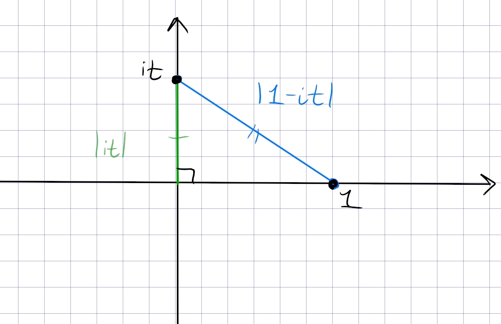

:::{.problem title="?"}
Find the number of zeros $z$ with $\Re(z) > 0$ for the following function:
\[
f(z) \da z^3-z+1
.\]
:::

:::{.solution}
Take a contour $\gamma_1 \da \ts{it \st t\in \RR}$ and $\gamma_2\da \ts{Re^{it} \st t\in [-\pi, \pi]}$.

- Big: $M(z) = z^3 + 1$
- Small: $m(z) = -z$

On $\gamma_2$, we have $\abs{z} = R$, so take $R$ large enough that the following estimate holds:
\[
\abs{M(z)} = \abs{z^3 + 1} \geq \abs{ \abs{z}^3 - 1} = R^3 - 1 > R
= \abs{m(z)} = R
.\]
In particular, this works for $R> 1$.

On $\gamma_1$, note

- $\abs{M(z)} = \abs{ (it)^3 + 1 } = \abs{1-it^3}$
- $\abs{m(z)} = \abs{it}$

These can be interpreted geometrically: the former is the hypotenuse of a triangle and the latter is a leg, so $\abs{M(z)} \geq \abs{m(z)}$ will hold:

Now note that $z^3 + 1$ has roots $\omega_3, \omega_3^2, \omega_3^3=-1$ for $\omega_k \da e^{i\pi\over k}$, and the first two are in the right half-plane.
So $2 = \size Z_M = \size Z_f$ by Rouché.
:::

