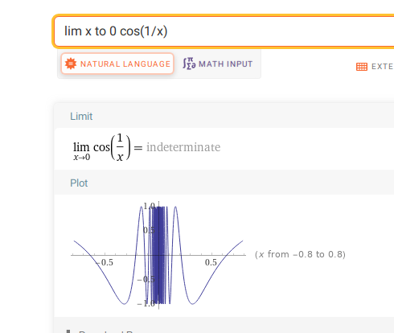

:::{.problem}
Give an example of a function $f:\RR\to \RR$ that is everywhere differentiable but $f'$ is not continuous at 0.
:::

:::{.solution}
The standard example:
\[
f(x) \da 
\begin{cases}
x^2\sin\qty{1\over x} & x\neq 0 
\\
0 & x=0.
\end{cases}
.\]

Away from zero, this is clearly differentiable since we can just compute the derivative by the chain rule. It turns out that
\[
f'(x) = 
\begin{cases}
2x\sin\qty{1\over x} + x^2 \cos\qty{1\over x}\qty{-1\over x^2} = 2x\sin\qty{1\over x} - \cos\qty{1\over x} & x\neq 0 
\\
0 & x=0.
\end{cases}
.\]
Here we check differentiability and compute the derivative at $x=0$ directly:
\[
{f(x) - f(0) \over x-0} = {x^2\sin\qty{1\over x} - 0 \over x-0} = x\sin\qty{1\over x} \convergesto{x\to 0} 0 
,\]
using that $-x \leq \abs{x\sin \qty{1\over x}}\leq x$.

But now notice that the $\cos\qty{1\over x}$ term in $f'$ isn't enveloped by an $x^c$ term, so $\lim_{x\to 0} f'(x)$ does not exist for oscillatory reasons:

In particular, $\lim_{x\to 0}f'(x) \neq f'(0) = 0$.
:::

