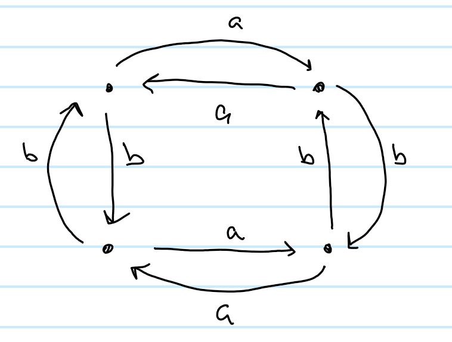
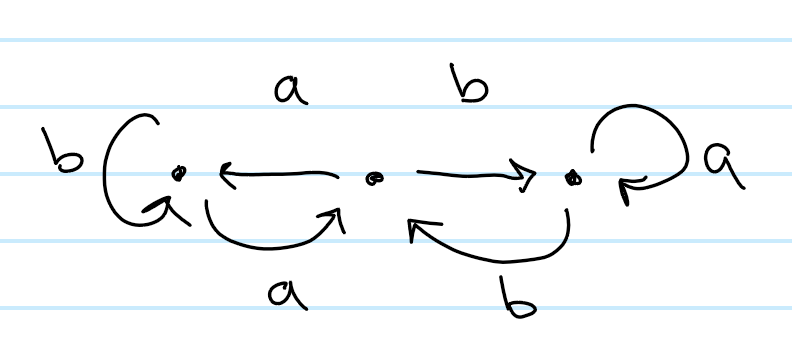
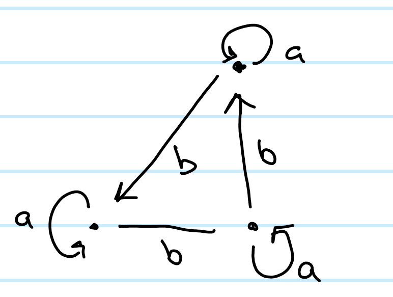
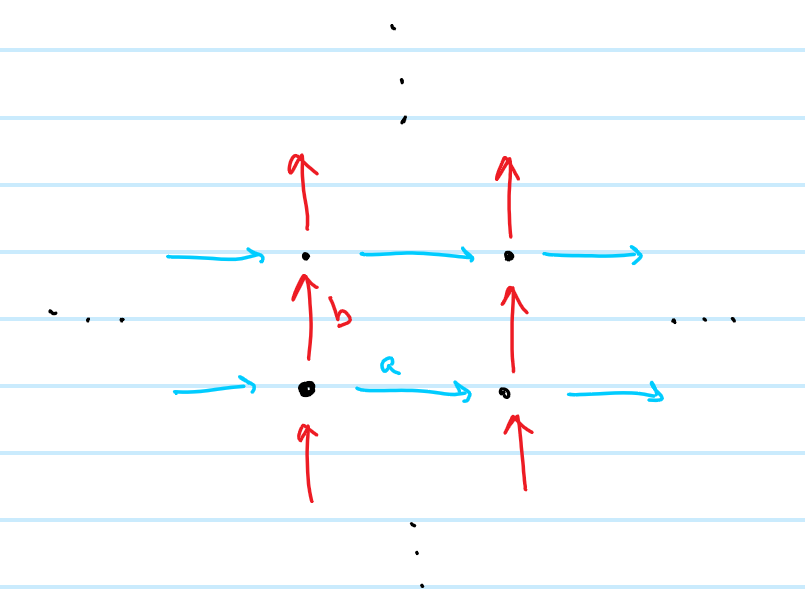
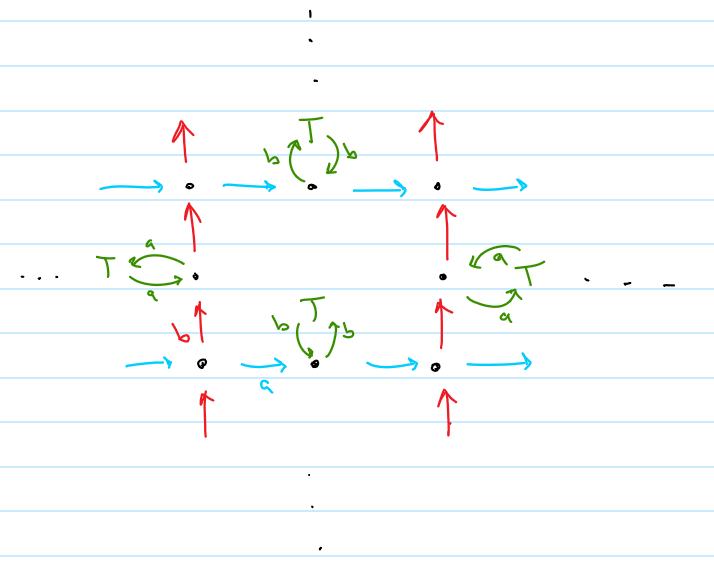

7. Generators of the subgroups:

1. $\left< ab^{-1}, aba^{-2}, a^3b^{-1}a^{-2}, a^3\right>$
2. $\left< b, aba^{-1}, a^2ba^{-2},a^3\right>$
3. $\left<b^2, ba, a^3, aba^{-1}\right>$
4. $\left<b\right>$
5. $\left<ba, b^{-1}a\right>$

Relevant covers:

1. 
2. 
3. 
4. 
5. Let $T$ be a copy of the Cayley Tree on two on the two generators $a, b$, then:
  

