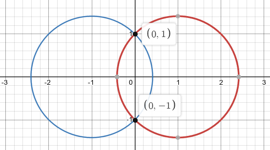
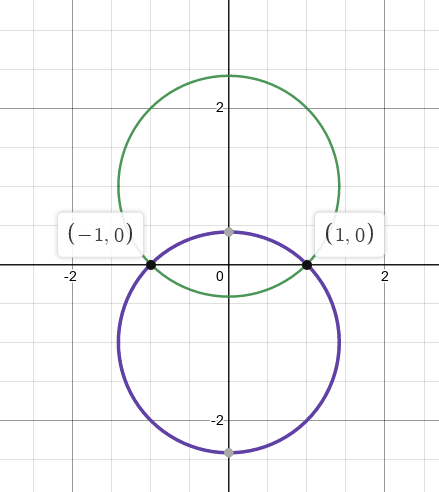
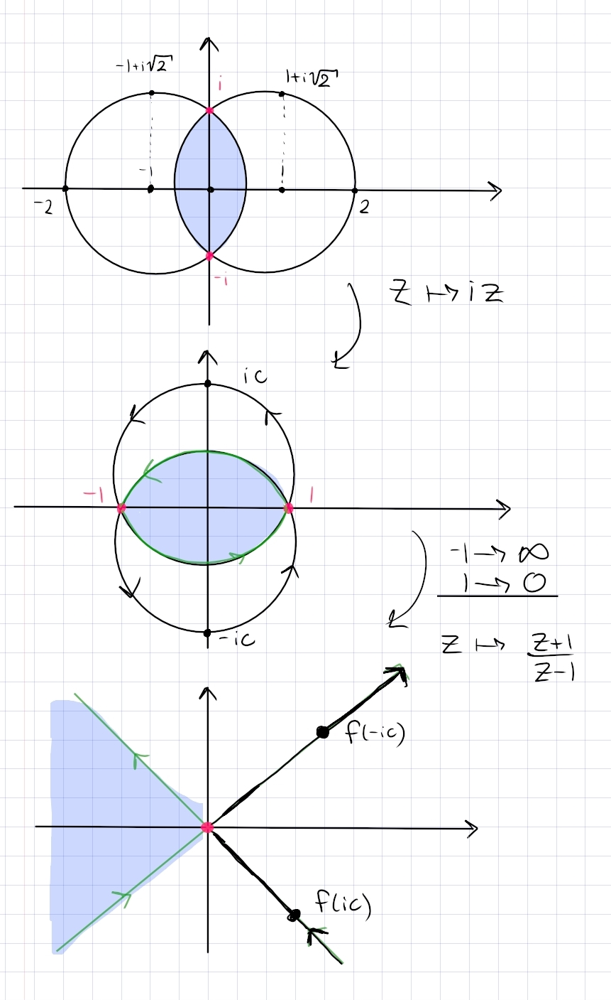

:::{.problem title="?"}
Find a conformal map from the intersection of $|z-1|<2$ and $|z+1|<2$ to the upper half plane.
:::

:::{.warnings}
DZG: I'm 90% sure this is meant to be $\abs{z-1}, \abs{z+1} < \sqrt{2}$ or $\abs{z-1}^2,\abs{z+1}^2 < 2$.
Otherwise computing the argument of the resulting lines is tricky...
:::

:::{.solution}
The region:

Note that you can find that $i, -i$ are the intersection points by noting that $i\RR$ is the perpendicular bisector through the line segment connecting the centers of the circles, then expanding $\abs{z-1}^2 = (x-1)^2 + y^2 = 2$ and setting $x=0$ to get $y=\pm i$.

First rotate this by $\pi/2$:

Call the upper circle $C_1$ and the lower $C_2$.
Send $-1\to 0, 1\to \infty$ by taking
\[
f(z) \da {z+1\over z-1}
.\]
This sends the circles to lines through zero, and the lune now spans a triangular sector.
Finding the angles of the lines: write $c\da 1 + \sqrt{2}$.
Note that $f$ fixes $\RR$, so the image regions are symmetric about $\RR$, and it suffices to find the angle of the line $f(C_1)$.
Note that $C_1 \intersect i\RR = ic$, so we compute $\Arg(f(ic))$:
\[
f(ic) 
&= {ic+1\over ic-1} \\
&= {(1+ic)^2 \over c^2 + 1} \\
&= {-1 + c^2 - 2ic \over c^2 + 1} \\
&= {c^2-1 \over c^2+1} -i {2c\over c^2+1}
,\]
so
\[
\Arg(f(ic)) 
&= \arctan\qty{ 2c\over -1 + c^2} \\
&= \arctan\qty{2(1+\sqrt 2) \over 1 - (3 + \sqrt 2)} \\
&= \arctan(-1) \\
&= {\pi\over 4} \text{ or } {3\pi \over 4}
.\]

Thus $f(C_1) = \ts{te^{-i\pi\over 4} \st t\in (-\infty, \infty)}$.
Note that $f(ic)\in Q_4$, since $c^2-1, c^2+1 > 0$ and ${-2c\over c^2+1} < 0$.
For the orientation of $f(C_1)$, note that $(1, ic, -1) \mapsto (\infty, f(ic), 0)$, so the line is oriented from $Q_4$ to $Q_2$.

A similar computation shows
\[
f(-ic) = {c^2-1\over c^2+1} + i{2\over c^2+1} \in Q_1
,\]
and $(-1, -ic, 1)\mapsto (0, f(-ic), \infty)$, so $f(C_2)$ is oriented from $Q_3$ to $Q_1$.

Since the origin region was to the left of the curves, it remains to the left, so the resulting region is $\ts{z\st 3\pi/4 < \Arg(z) < 5\pi/4}$:

From here, it's a standard exercise, so to sum up:

- Rotate $R\to \tilde R$ by $z\mapsto iz$ to get a horizontal lune with intersection points $\pm 1$.
- Send $-1\to \infty, 1\to 0$ by $z\mapsto {z+1\over z-1}$ to send $\tilde R \to 3\pi/4 < \Arg(z) < 5\pi/4$.
- Reflect by $z\mapsto -z$ to get $-\pi/4 < \Arg(z) < \pi/4$.
- "Open" by $z\mapsto z^{\pi \over 2 \theta_0}$ to map to $-\pi/2<\Arg(z) < \pi/2$, where here $\theta_0 \da {\pi \over 4}$.
- Rotate by $z\mapsto iz$ to get $0 < \Arg(z) < {\pi \over 2}$, i.e. $\HH$.
- Use the Cayley map $z\mapsto {z-i\over z+i}$ to send $\HH\to \DD$.

:::
