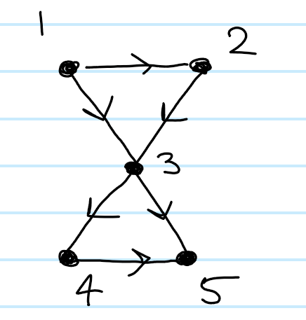

::: problem
1. Figure 8  Here we have: $C_3 = \emptyset$ $C_1 = [12], [23], [13], [34], [35], [45] \cong \ZZ^6$ $C_0 = [1], [2], [3],[4], [5] \cong \ZZ^5$

So we have $C_2 \into C_1 \into C_0 \cong 0\xrightarrow{\del_2} \ZZ^6 \xrightarrow{\del_1} \ZZ^5\xrightarrow{\del_0} 0$

Computing boundary operators, we have

$\del_1([12]) = [2] - [1]$ $\del_1([23]) = [3] - [2]$ $\del_1([13]) = [3] - [1]$ $\del_1([34]) = [4] - [3]$ $\del_1([35]) = [5] - [3]$ $\del_1([45]) = [5] - [4]$

$\del_0 = 0$

And so $H_0 = \ker \del_0/\im\del_1 = \frac{C_0}{<\del_1([ij])>}$, but from the above calculation we have $[5] = [4] = [3] = [2] = [1]$ in the quotient, so there is just one generator and $H_0  \cong \ZZ$.

Note that $\del_2$ is an injection from 0 into $C_1$, since there are no 2-simplices.
Moreover, one can generate two 1-cycles, so we have $H_1 = \frac{\ker \del_1}{\im \del_2} =\frac{<[23]-[31] + [12],~[45] - [35] + [34]>}{0} \cong \ZZ^2$.

One way to see that these are the generators is to pretend there are two 2-simplices, $[123], [345]$ and compute $\del_2$ of both of them.
Since $\del_1\del_2 = 0$, anything in the image of $\del_2$ would have to go to zero anyways, and would thus be in the kernel of $\del_1$.
Since it's not actually the boundary of any 2-chain, it doesn't become trivial in homology.

So we have $H_2 \into H_1 \into H_0 = 0 \into \ZZ^2 \into \ZZ$.
:::
