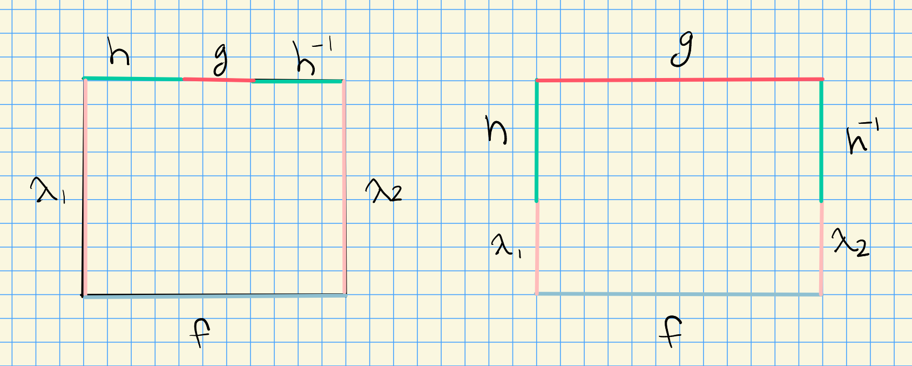

::: {.problem title="?"}
Let $S^1$ denote the unit circle in $C$, $X$ be any topological space, $x_0 \in X$, and $$\gamma_0, \gamma_1 : S^1 \to X$$ be two continuous maps such that $\gamma_0 (1) = \gamma_1 (1) = x_0$.

Prove that $\gamma_0$ is homotopic to $\gamma_1$ if and only if the elements represented by $\gamma_0$ and $\gamma_1$ in $\pi_1 (X, x_0 )$ are conjugate.
:::

::: {.concept}
\envlist

- Any two maps $f_i: Y\to X$ are **homotopic** iff there exists a homotopy $H: I\cross Y \to X$ with $H_0 = f_0$ and $H_1 = f_1$.

- $\pi_1(X; x_0)$ is the set of maps $f:S^1\to X$ such that $f(0) = f(1) = x_0$, modulo being homotopic maps.

- Loops can be homotopic (i.e. *freely* homotopic) without being homotopic rel a base point, so not equal in $\pi_1(X; x_0)$.

  - Counterexample where homotopic loops are not equal in $\pi_1$, but just conjugate.
    Need nonabelian $\pi_1$ for conjugates to possibly not be equal, so take a torus:

  
:::

::: {.solution}
$\implies$:

- Suppose $\gamma_1 \homotopic \gamma_2$, then there exists a free homotopy $H: I\cross S^1 \to X$ with $H_0 = \gamma_0, H_1 = \gamma_1$.

- Since $H(0, 1) \gamma_0(1) = x_0$ and $H(1, 1) = \gamma_1(1) =  x_0$, the map
\[
T: [0, 1] &\to X \\
t &\mapsto H(t, 1)
\]
descends to a loop $T:S^1\to X$.

- Claim: $\gamma_1$ and $T\ast \gamma_2 \ast T\inv$ are homotopic rel $x_0$, making $\gamma_1, \gamma_2$ conjugate in $\pi_1$.

  - Idea: for each fixed $s$, follow $T$ for the first third, $\gamma_2$ for the middle third, $T\inv$ for the last third.

  

$\impliedby$:

- Suppose $[\gamma_1] = [h] [\gamma_2] [h]\inv$ in $\pi_1(X; x_0)$.
  The claim is that $\gamma_1 \homotopic h\gamma_2 h\inv$ are freely homotopic.

- Since these are equal in $\pi_1$, we get a square interpolating $\gamma_1$ and $h\gamma_2 h\inv$ with constant sides $\id_{x_0}$.

- For free homotopies, the sides don't have to be constant, to merge $h$ and $h\inv$ into the sides to get a free homotopy from $f$ to $g$:

:::
