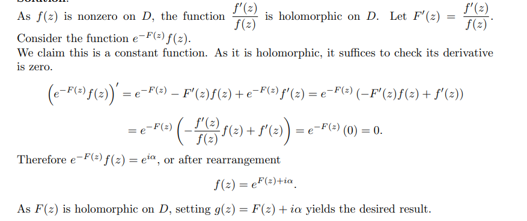

::: {.exercise title="?"}
Prove that if $D$ is a simply connected domain and $f(z)$ is holomorphic and nonzero on $D$, then $f(z)=e^{g(z)}$, where $g(z)$ is holomorphic on $D$.
:::

::: {.solution}

:::
