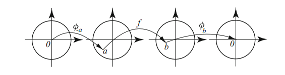

:::{.problem title="?"}
Let $f$ be a holomorphic map of the open unit disc $\DD$ to itself.
Show that for any $z, w\in \DD$,
\[
\left|\frac{f(w)-f(z)}{1-\overline{f(w)} f(z)}\right| \leq\left|\frac{w-z}{1-\bar{w} z}\right|
.\]
Show that this inequality is strict for $z\neq w$ except when $f$ is a linear fractional transformation from $\DD$ to itself.
:::

:::{.concept}

The Schwarz conjugation trick:

Write the RHS as $a$, we then want something in the form $\abs{F(a)}\leq \abs{a}$.
The choice $a=\psi_w(z)$ is forced, so $z= \psi_w\inv(a)$.
This forces the choice for the LHS
\[
{ f(w) - (f\circ \psi_w\inv)(a) \over 1 - \bar{f(w)} (f\circ \psi_w\inv)(a) } 
= (\psi_{f(w)} \circ f \circ \psi_w\inv)(a) \da F(a)
.\]

:::

:::{.solution}
This is the **Schwarz–Pick lemma**.

- Fix $z_1$ and let $w_1 = f(z_1)$.
  Define
  \[
  \psi_{a}(z) \da {a-z \over 1-\bar{a}z} \in \Aut(\DD)
  .\]

  - Note that inequality now reads
  \[
  \abs{\psi_{f(w)}(f(z)) } \leq \abs{\psi_w(z)}
  .\]
  Moreover $\psi_a$ is an involution that swaps $a$ and $0$.

- Now set up a situation where Schwarz's lemma will apply: 
\[
0 \mapsvia{\psi_{z_1}} z_1 \mapsvia{f} f(z) \mapsvia{\psi_{f(z_1)}} 0 
,\]
  so $F\da \psi_{f(z_1)} \circ f \circ \psi_{z_1} \in \Aut(\DD)$ and $F(0) = 0$.

- Apply Schwarz we get $\abs{F(z)} \leq \abs{z}$ for all $z$, so
\[
\abs{F(z)} &\leq \abs{z} \\
\implies \abs{
f(z_1) - (f\circ \psi_{z_1})(z) 
\over 
1 - \bar{f(z_1)} \cdot (f\circ \psi_{z_1}) (z)
} &\leq \abs{ z} \\
\implies \abs{f(z_1) - f(w) \over 1 - \bar{f(z_1)}\cdot f(w) }
&\leq \abs{\psi_{z_1}(z)}
&& w\da \psi_{z_1}(z) \\
\implies \abs{f(z_1) - f(w) \over 1 - \bar{f(z_1)}\cdot f(w) }
&\leq \abs{z_1 - z \over 1 - \bar{z_1} z }
.\]

- Since $z_1$ was arbitrary and fixed and $w$ was a free variable, this holds for all $z,w\in \DD$.

- Strictness: suppose equality holds, we'll show that $f(z) = {az+b\over cz+d}$
- By Schwarz, $F(z) = \lambda z$ for $\lambda \in S^1$.
  Thus
  \[
  (\psi_{f(z_1)} \circ f \circ \psi_{z_1}) (z) &= \lambda z \\
  \implies
  (f \circ \psi_{z_1}) (z) &= \psi_{f(z_1)}\inv(\lambda z ) \\
  \implies
  f(w) &= \psi_{f(z_1)}\inv(\lambda \psi_{z_1}\inv(w) ) 
  && w\da \psi_{z_1}(z) \\
  &= \psi_{f(z_1)} \qty{\lambda \psi_{z_1}(w)} \\
  &= \lambda \psi_{\bar \lambda f(z_1)} \qty{\psi_{z_1}(w)} \\
  &\da \lambda \psi_a(\psi_b(w)) \\
  &=\lambda\qty{ a- \psi_b(w) \over 1 - \bar a \psi_b(w) } \\
  &= \quad \vdots \\
  &= -\lambda \qty{ \frac{{\left(a \overline{b} - 1\right)} z - a + b}{{\left(\overline{a} - \overline{b}\right)}z - b \overline{a} + 1} } \\
  &= \qty{ \frac{-\lambda {\left(a \overline{b} - 1\right)} z + \lambda( a - b)}{{\left(\overline{a} - \overline{b}\right)}z + (- b \overline{a} + 1)} }
  ,\]
  which is evidently a linear fractional transformation.

:::
