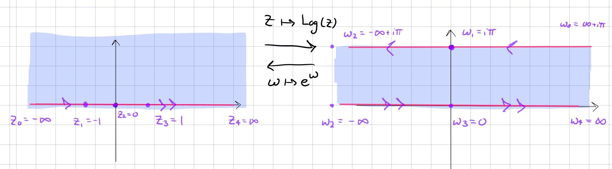

:::{.proposition title="Upper half-plane to horizontal strip"}
\[
F: \HH &\to \RR \times i(0, \pi) \\
z &\mapsto \Log(z) \\
e^w &\mapsfrom w
.\]

- Why this lands in a strip: use that $\arg(z) \in (0, \pi)$ and $\log(z) = \abs{z} + i\arg(z)$.
:::
