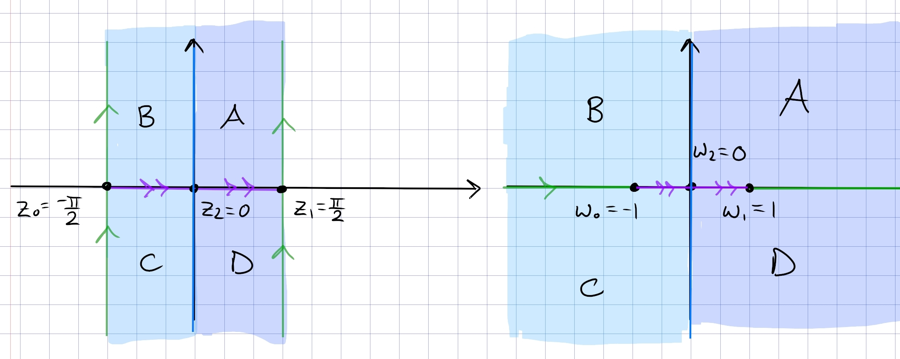

:::{.proposition title="Upper half-plane to centered vertical half-strip"}
\[
F: \HH &\to \qty{-{\pi \over 2}, {\pi \over 2}} \cross i\RR \\
z &\mapsto \sin(z)
.\]

The mapping $z\mapsto \sin(z)$:

- As $z$ travels from $i\infty \to i0$, $\sin(iz) = i\sinh(z)$ also traverses $i\infty\to i0$ 
- For $z\in[-\pi/2, \pi/2]$, $\sin(z)$ is real and in $[-1, 1]$.
- As $z$ travels along $\pi/2 + it$ for $t\in [0, \infty)$, $\sin(\pi/2 + it) = \cosh(t)$ traverses $1\to \infty$ along $\RR$

Note that this isn't new: set $w \da e^{iz}$, then
\[
\sin(z) = -{1\over 2}\qty{iw + {1\over iw}}
,\]
which is the composition
\[
\qty{z \mapsto e^{z} } \circ \qty{z\mapsto iz} \circ \qty{z\mapsto {1\over 2}(z+z\inv)}
.\]

:::
