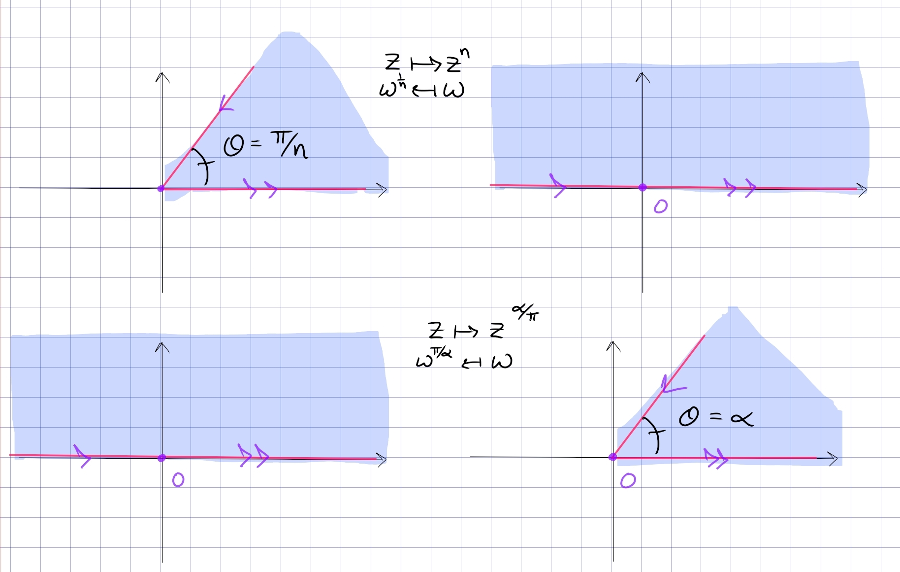

:::{.proposition title="Upper-half-plane to sectors and back"}
\[
F: \ts{z\st \Arg(z) \in \qty{0, {\pi \over n}} } &\to \HH \\
z &\mapsto z^n \\
w^{1\over n} &\mapsfrom w
.\]

More generally, for $0 < \alpha < 2$,
\[
F: \HH &\to \ts{z\st \Arg(z) \in \qty{0, \alpha} } \\
z &\mapsto z^{\alpha\over \pi} \\
w^{\pi \over \alpha} &\mapsfrom w
.\]

:::
