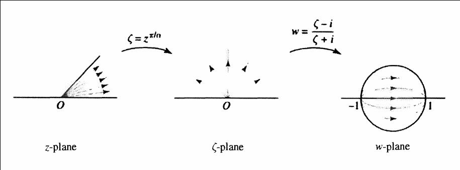

:::{.proposition title="Sector to Disc"}
The unmotivated formula first:
\[
F: S_{\alpha} &\to \DD \\ \\
\ts{ z \st 0 < \Arg(z) < \alpha } &\mapstofrom \ts{ w \st \abs{w} < 1 } \\
z &\mapstofrom {z^{\pi\over \alpha} - i \over z^{\pi\over\alpha} + i}
.\]

Idea: compose some known functions.

\[
S_{\alpha} &\to S_{\pi} = \HH \to \DD \\
z &\mapsto z^{\pi \over \alpha} \mapsto {z-i\over z+i}\evalfrom_{z= z^{\pi\over \alpha}}
.\]

:::
