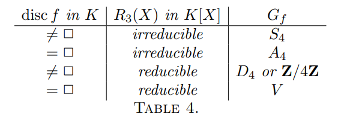
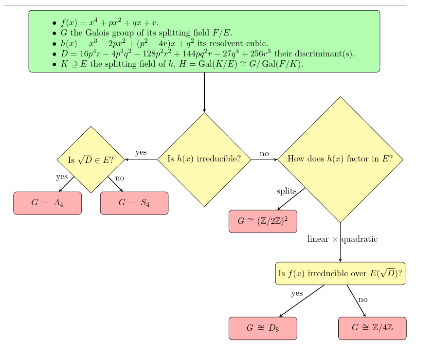

::: {.proposition title="Classification for quartics"}
The Galois groups of irreducible quartics can be determined using discriminants, resolvents, and checking irreducibility:

- If $\sqrt{\Delta}\in \QQ$, then $G = A_4, C_2^2$.

  - If resolvent is irreducible: $A_4$.
    Otherwise $C_2^2$.

- If $\sqrt{\Delta}\not\in \QQ$ then $G = S_4, D_4, C_4$.

  - Is resolvent is irreducible: $S_4$.
    Otherwise, $D_4$ or $C_4$, argue by cycle types (or if $f$ is irreducible in $\QQ(\sqrt{\Delta})$, $D_4$).

- Summary: 

A flow chart summarizing the full process:

See Hungerford 273 for classification.
:::
