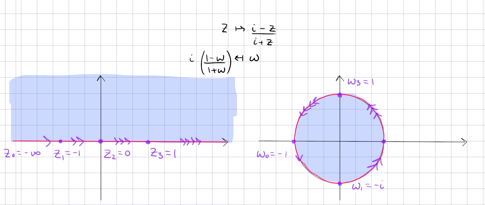
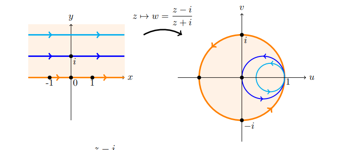

:::{.proposition}
\[
\Psi: \HH&\mapstofrom \DD \\
z &\mapsto {z-i \over z+i} \\
i \qty{1+w \over 1-w} &\mapsfrom w
.\]

Mnemonic: every $z\in \HH$ is closer to $i$ than $-i$.
This restricts to a map
\[
\Psi: Q_1 &\mapstofrom \DD \intersect \HH
.\]

:::
