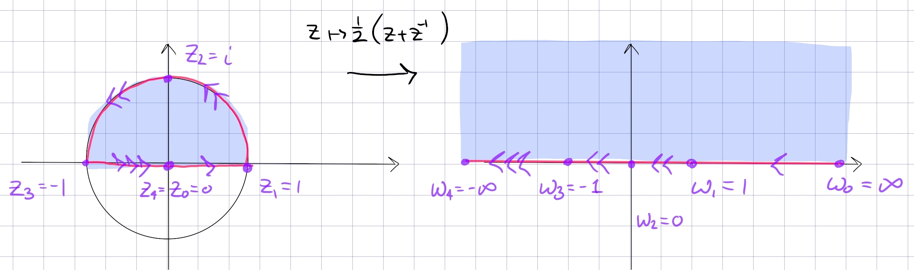

:::{.proposition title="Upper half-disc to upper half-plane"}
\[
F: \DD \intersect \HH &\to \HH \\
z & \mapsto -{1\over 2}\qty{ z + z\inv }
.\]

- It additionally maps $\DD^c\to \RR\sm[-1, 1]$.
- A similar variant: $z\mapsto {1\over 2i}(z+z\inv)$ sends $Q_{14}$ to $\CC\sm\ts{t\in \RR \st \abs{t} \geq 1}$, the plane with a slit on $\RR$ through infinity (i.e. a doubly slit plane).

> This is sometimes referred to as a *Joukowski map*.o
> The inverse is a bit complicated.

:::
