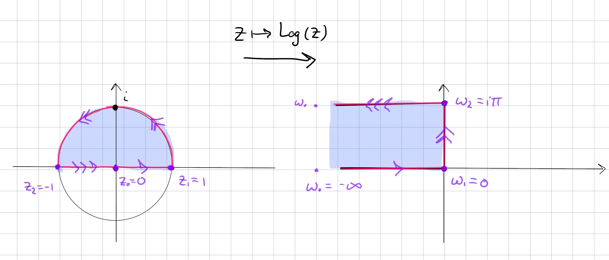

:::{.proposition title="Upper half-disc to horizontal upper-left-half-strip"}
\[
F: \DD \intersect \HH &\to \RR_{<0} \times i (0, i\pi) \\
z &\mapsto \Log(z) \\
e^w &\mapsfrom w
.\]

In general,

- $\DD \intersect \HH$ maps to a half-strip in $Q_2$
- $\DD \intersect Q_{34}$ maps to a half-strip in $Q_1$.
- $\DD^c \intersect \HH$ maps to a half-strip in $Q_1$
- $\DD^c \intersect Q_{34}$ maps to a half-strip in $Q_4$

:::
