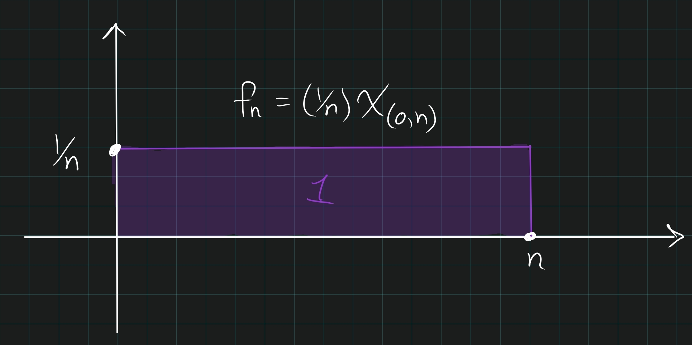
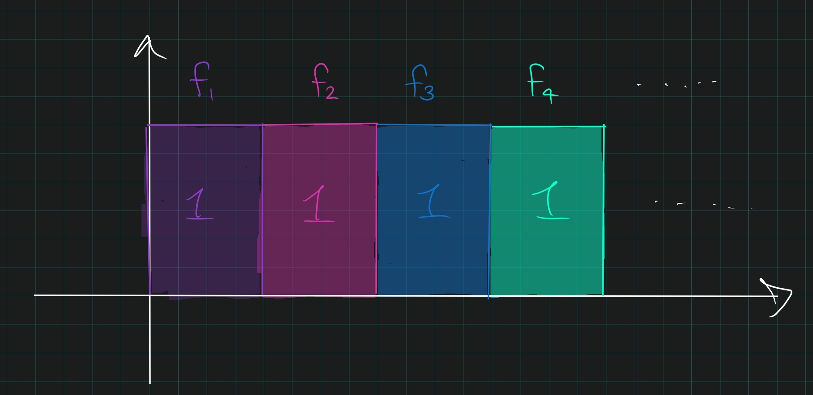
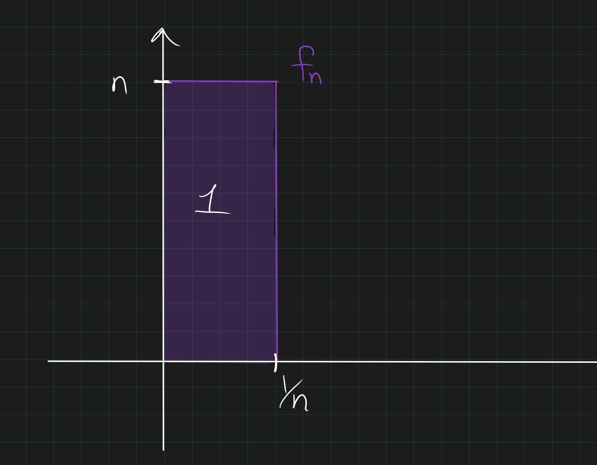
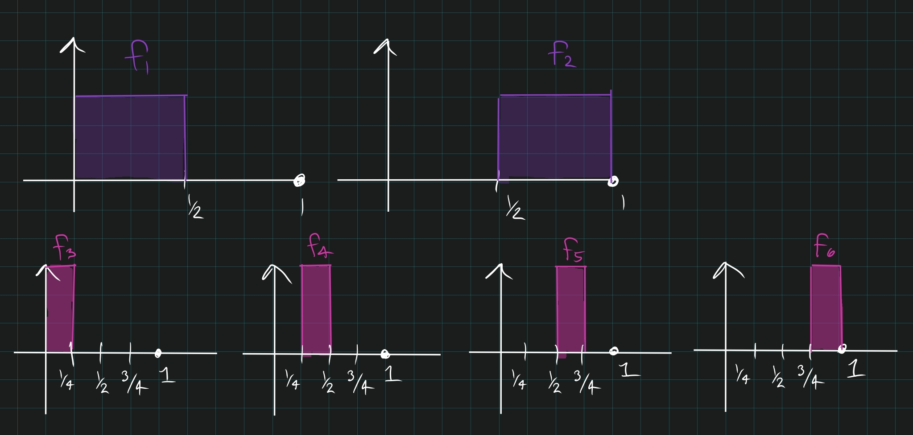

::: {.proposition title="The four big counterexamples in convergence"}
\envlist

1. Uniform: $f_n \uniformlyconverges f: \forall \varepsilon ~\exists N \suchthat ~n\geq N \implies \abs{f_N(x) - f(x)} < \varepsilon \quad \forall x.$

2. Pointwise: $f_n(x) \to f(x)$ for all $x$.
   (This is just a sequence of numbers)

3. Almost Everywhere: $f_n(x) \to f(x)$ for almost all $x$.

4. Norm: $\norm{f_n - f}_1 = \int \abs{f_n(x) - f(x)} \to 0$.

We have $1 \implies 2 \implies 3$, and in general no implication can be reversed, but (**warning**) none of $1,2,3$ imply $4$ or vice versa.

- $f_n = (1/n) \chi_{(0, n)}$.
  This converges uniformly to 0, but the integral is identically 1. So this satisfies 1,2,3 and not 4.

  

- $f_n = \chi_{(n, n+1)}$ (skateboard to infinity).
  This satisfies 2,3 but not 1, 4.

  

- $f_n = n\chi_{(0, \frac 1 n)}$.
  This satisfies 3 but not 1,2,4.

  

- $f_n:$ one can construct a sequence where $f_n \to 0$ in $L^1$ but is not 1,2, or 3. The construction:

  - Break $I$ into $2$ intervals, let $f_1$ be the indicator on the first half, $f_2$ the indicator on the second.

  - Break $I$ into $2^2=4$ intervals, like $f_3$ be the indicator on the first quarter, $f_4$ on the second, etc.

  - Break $I$ into $2^k$ intervals and cyclic through $k$ indicator functions.

  

  - Then $\int f_n = 1/2^n \to 0$, but $f_n\not\to 0$ pointwise since for every $x$, there are infinitely many $n$ for which $f_n(x) = 0$ and infinitely many for which $f_n(x) = 1$.
:::
