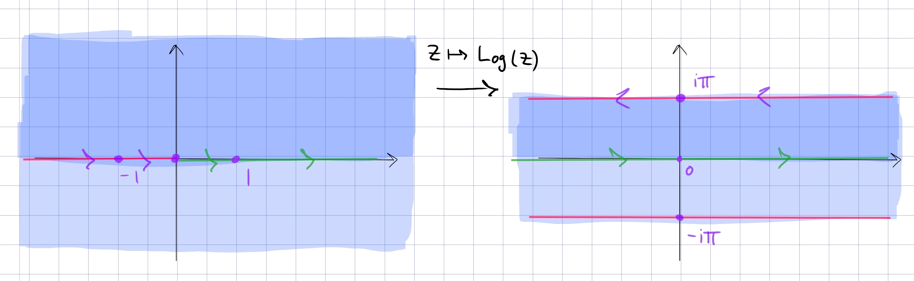

:::{.proposition title="Slit plane to horizontal strip"}
\[
F: \CC\sm\RR_{\leq 0} &\to \RR \cross i(-\pi, \pi) \\
z &\mapsto \Log(z)
.\]

- Circles of radius $R$ are mapped to vertical line segments connecting $\ln(R) + i\pi$ to $\ln(R) - i\pi$, and rays are mapped to horizontal lines.
- Inverse is useful: $z\mapsto e^z$ sends $\ts{ \abs{ \Re(z) } < \pi/2 }$ to $Q_{14}$, the right half-plane.

:::
