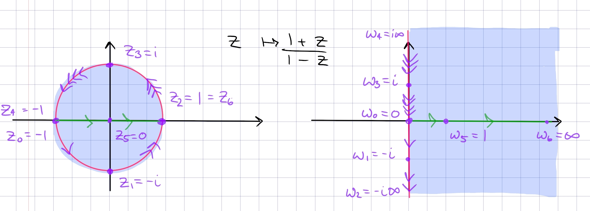
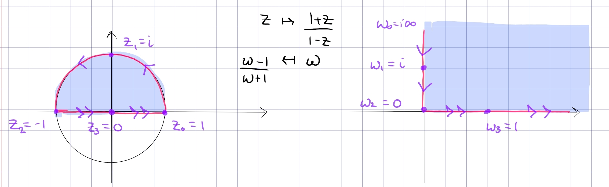

:::{.proposition title="Disc to right half-plane"}
\[
F: \DD &\mapsto Q_{12} \da \ts{\Re(z) > 0} \\
z &\mapsto {1+z \over 1-z} \\
{w-1\over w+1} &\mapsfrom w
.\]

This satisfies 
\[
\tv{-1, 0, 1} \mapsto \tv{0, 1, \infty}
.\]

Note that $\Psi$ inverse from above can be recovered by post-composing with a rotation by $\pi/2$:
\[
\Psi\inv(z) = i\qty{1+z\over1-z} = i \cdot F(z) && \DD \mapsvia{F} Q_{12} \mapsvia{\cdot i} \HH
,\]
and up to a negative sign, we can recover $\Psi$ by recomposition with a rotation by $-\pi/2$:
\[
F(-iz) = {1+ iz \over 1-iz} = {-i + z \over -i-z} = -{z-i\over z+i} = -\Psi(z) && \HH \mapsvia{\cdot -i} Q_{12} \mapsvia{F} \DD
.\]

This restricts to a map $F: \DD \intersect \HH\to Q_1$:

- Why this lands in the first quadrant: 
  - Use that squares are non-negative and $z=x+iy\in \DD \implies x^2 + y^2 < 1$:
\[
f(z)=\frac{1-\left(x^{2}+y^{2}\right)}{(1-x)^{2}+y^{2}}+i \frac{2 y}{(1-x)^{2}+y^{2}}
.\]
- Why the inverse lands in the unit disc:
  - For $w$ in Q1, the distance from $w$ to 1 is smaller than from $w$ to $-1$.
  - Check that if $w=u+iv$ where $u, v>0$, the imaginary part of the image is positive:

\[
{w-1 \over w+1} 
&= { (w-1) \bar{(w+1)} \over \abs{w+1}^2}\\
&={ \qty{u-1 + iv} \qty{u+1-iv} \over (u+1)^2 + v^2 } \\
&= {u^2 + v^2 + 1 \over (u+1)^2 + v^2}
+ i\qty{ 2v \over (u+1)^2 + v^2}
.\]

**Boundary behavior**:

- On the upper half circle \( \ts{ e^{it } \st t\in (0, \pi)  } \), write 
\[
f(z)=\frac{1+e^{i \theta}}{1-e^{i \theta}}=\frac{e^{-i \theta / 2}+e^{i \theta / 2}}{e^{-i \theta / 2}-e^{i \theta / 2}}=\frac{i}{\tan (\theta / 2)}
,\]
  so as $t$ ranges $0\to \pi$ we have $f(z)$ ranging from $0\to i\infty$ along the imaginary axis.

:::
