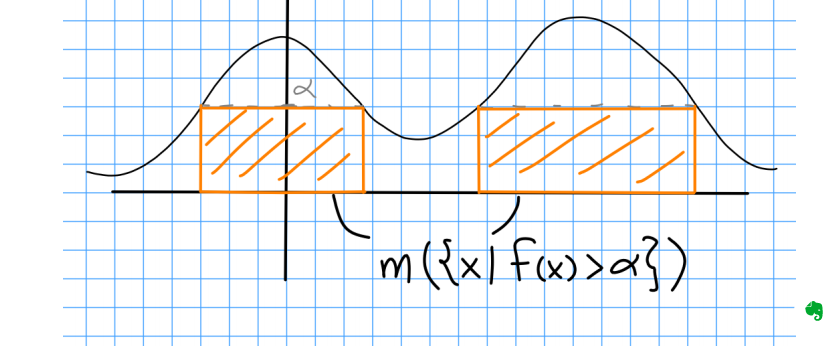

:::{.proposition title="Markov/Chebyshev's Inequality"}
The most often used form here:
\[  
\mu \qty{ f\inv\qty{(\alpha, \infty)} } \da \mu\qty{\ts{ x\in X \st \abs{f(x)} > \alpha  }} \leq {1\over \alpha} \norm{f}_1 \da {1\over \alpha} \int_X \abs{f}
.\]
Proof: let $S_\alpha$ be the set appearing, then $\alpha \mu(S_\alpha)$ is the sum of areas of certain boxes below the graph of $f$.
Interpret $\int_X f$ as the total area under the graph to make the inequality obvious.

The probability interpretation: $\PP(X\geq \alpha) \leq {1\over \alpha} \EE(X)$.

The more general version:
\[
\mu \qty{ f\inv\qty{(\alpha, \infty)} } \da \mu\qty{\ts{ x\in X \st \abs{f(x)} > \alpha }  } \leq {1\over \alpha^p} \norm{f}_p^p \da{1\over \alpha^p} \int_X \abs{f}^p 
.\]
Proof:
\[
\norm{f}_p^p = \int \abs{f}^p \geq \int_{S_\alpha} \abs{f}^p \geq \alpha^p \int_{S_\alpha} 1 = \alpha^p \mu(S_\alpha)
.\]

:::
