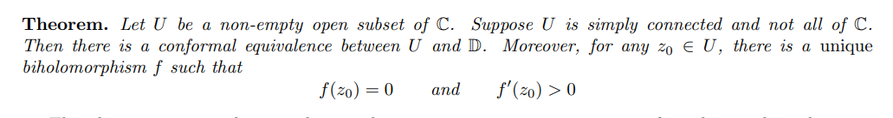

::: {.theorem title="Riemann Mapping"}
If $\Omega$ is simply connected, nonempty, and not all of $\CC$, then for every $z_{0}\in \Omega$ there exists a unique conformal map $F:\Omega \to \DD$.
Moreover, it can be arranged so that $F(z_{0}) = 0$ and $F'(z_{0}) > 0$.

Thus any two such sets $\Omega_{1}, \Omega_{2}$ are conformally equivalent.

:::
