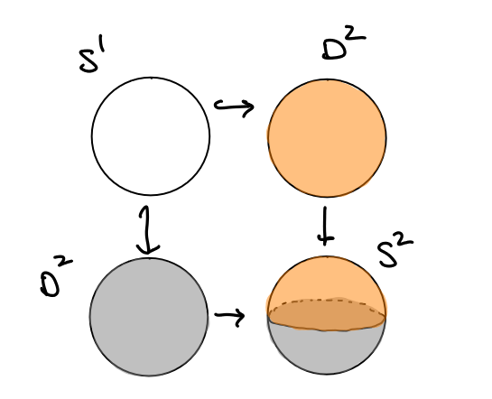

:::{.theorem title="Seifert-van Kampen"}
Suppose $X = U_{1} \union U_{2}$ where $U_1, U_2$, and $U \da U_{1} \intersect U_{2} \neq \emptyset$ are open and path-connected 
[^path_connected_necessary]

, and let $x_0 \in U$. 

Then the inclusion maps $i_{1}: U_{1} \injects X$ and $i_{2}: U_{2} \injects X$ induce the following group homomorphisms:
\[
i_{1}^*: \pi_{1}(U_{1}, x_0) \into \pi_{1}(X, x_0) \\
i_{2}^*: \pi_{1}(U_{2}, x_0) \into \pi_{1}(X, x_0)
\]

There is a natural isomorphism
\[
\pi_{1}(X) \cong \pi_{1} U \ast_{\pi_{1}(U \intersect V)} \pi_{1} V
,\]

where the amalgamated product can be computed as follows:
A **pushout** is the colimit of the following diagram

\begin{tikzcd}
A \Disjoint_{Z} B   & A\ar[l] \\
B \ar[u]          & Z \ar[l, "\iota_{B}"] \ar[u, "\iota_{A}"]
\end{tikzcd}

For groups, the pushout is realized by the amalgamated free product: if 
\[
\begin{cases}
\pi_1 U_1 = A = \generators{G_{A} \suchthat R_{A}} \\
\pi_1 U_2 = B = \generators{G_{B} \suchthat R_{B}}
\end{cases}
\implies 
A \ast_{Z} B \da \gens{ G_{A}, G_{B} \suchthat R_{A}, R_{B}, T}
\]
where $T$ is a set of relations given by 
\[
T = \theset{\iota_{1}^*(z) \iota_{2}^*  (z) ^{-1}   \suchthat z\in \pi_1 (U_1 \intersect U_2)}
,\]
where $\iota_2^*(z) ^{-1}$ denotes the inverse group element.
If we have presentations

\[ 
\pi_{1}(U, x_0) &=
\left\langle u_{1}, \cdots, u_{k} \suchthat \alpha_{1}, \cdots, \alpha_{l}\right\rangle \\ 
\pi_{1}(V, w) &=\left\langle v_{1}, \cdots, v_{m} \suchthat \beta_{1}, \cdots, \beta_{n}\right\rangle \\ 
\pi_{1}(U \cap V, x_0) 
&=\left\langle w_{1}, \cdots, w_{p} \suchthat \gamma_{1}, \cdots, \gamma_{q}\right\rangle 
\]

then
\[
\pi_{1}(X, w) 
&= \left\langle 
u_{1}, \cdots, u_{k}, v_{1}, \cdots, v_{m} 
\middle\vert
\begin{cases}
\alpha_{1}, 
\cdots, 
\alpha_{l}
\\
\beta_{1}, 
\cdots, 
\beta_{n}
\\
  I\left(w_{1}\right) J\left(w_{1}\right)^{-1}, 
  \cdots, 
  I\left(w_{p}\right) J\left(w_{p}\right)^{-1}
\\ 
\end{cases}
\right\rangle \\ \\
&= 
\frac{
  \pi_{1}(U_1) \ast \pi_{1}(U_2)
} {
  \generators{
    \theset{\iota_1^*(w_{i}) \iota_2^*(w_{i})\inv \suchthat 1\leq i \leq p}
  }
}
\]
Note that the hypothesis that $U_1 \intersect U_2$ is path-connected is necessary: take $S^1$ with $U,V$ neighborhoods of the poles, whose intersection is two disjoint components.

:::

[^path_connected_necessary]:
