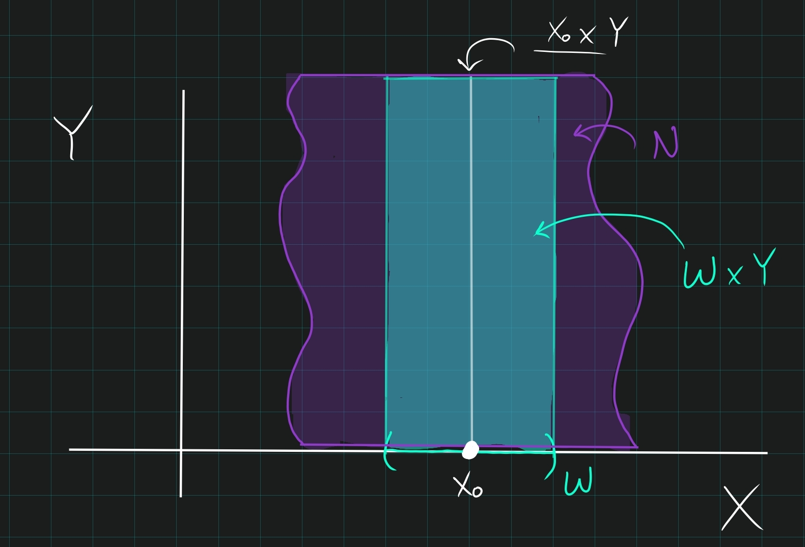

::: {.theorem title="The Tube Lemma"}
Let $X, Y$ be spaces with $Y$ compact, and let $x_0\in X$.
Let $N\subseteq X\cross Y$ be an open set containing the slice $x_0 \cross Y$, then there is a neighborhood $W\ni x$ in $X$ such that $N \supset W\cross Y$:

:::
