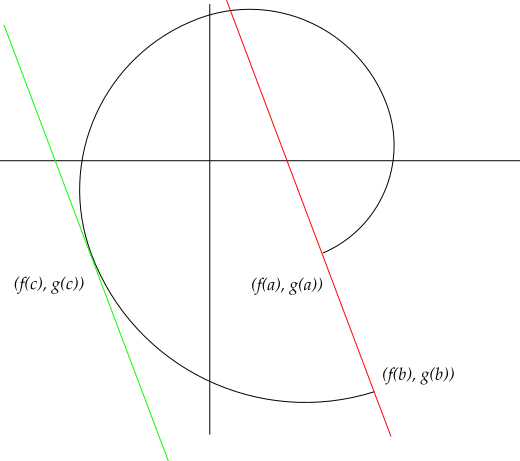

:::{.theorem title="Mean Value Theorem"}
If $f: [a, b] \to \RR$ is continuous on a closed interval and differentiable on $(a, b)$, then there exists $\xi \in [a, b]$ such that 
\[
f(b) - f(a) = f'(\xi)(b-a)
.\]

More generally, if $g: [a,b]\to \RR$ is similarly continuous on $[a, b]$ and differentiable on $(a, b)$, then there exists a $\xi$ with
\[
\qty{ f(b) - f(c) } g'(\xi) = \qty{g(b) - g(a)} f'(\xi)
.\]
What this means graphically:

:::
