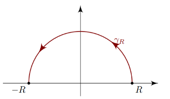

:::{.theorem title="Jordan's Lemma"}

For $\alpha > 0$,
define
\[
C_R \da \ts{ z=Re^{it} \st t\in [0, \pi] }
.\]

\[
\abs{\int_{C_R} e^{i\alpha z} g(z) \dz} \leq \pi\alpha\inv M_R \qquad M_R \da \sup_{z\in C_R} \abs{g(z)}
.\]
Note that if $M_R\to 0$ as $R\to \infty$, this integral vanishes -- so this works if $M_R \in \bigo\qty{1\over R^\eps}$ for $\eps>0$.

For $\alpha < 0$, the same statement holds with the contour replaced by $\tilde C_R\da \ts{Re{it} \st t\in [0, -\pi]}$.
This is because the main estimate involves
\[
\cdots & \leq \lim _{R \rightarrow \infty} \int_{H_{R}} e^{-\alpha R \sin \theta}|F(z)| R d \theta
,\]
which goes to zero if $-\alpha n\sin(\theta)<0$, i.e. 

- $\alpha>0$ and $\sin(\theta)>0$, so $C_R$ is in the upper half-plane, or
- $\alpha < 0$ and $\sin(\theta)<0$, so $C_R$ is in the lower half-plane.

:::
