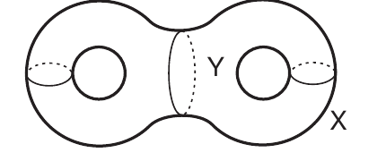

::: {.problem title="?"}
Let $X$ be the surface of genus $2$ shown below and let $Y \supseteq X$ be the region of $\mathbb{R}^3$ that it encloses.
Show that there is no retraction $r : Y \to X$ (that is, no continuous map for which $r(x) = x$ for all $x \in X$).

:::
