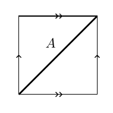

:::{.problem title="?"}
Consider the simple closed curve $A$ contained in the torus $T$, as shown below. Sometimes $A$ is a
called a $(1,1)$-curve. Use the long exact sequence of relative homology groups to compute
$H_n(T,A)$ for all $n$. (You may state the homology groups $\widetilde H_n(T)$ and
$\widetilde H_n(S^1)$ without proof.)

:::
