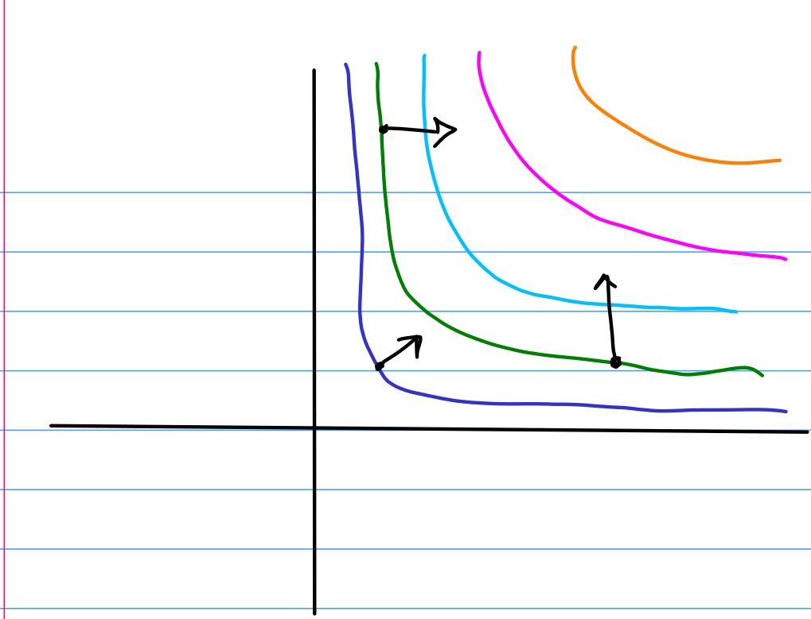

# Fall 2016

2. The gradient $\nabla f = [y, x]$ will be orthogonal to level curves: 

3. $A = \left[ \begin{array} { r r r } { 1 } & { - 2 } & { 1 } \\ { 0 } & { 5 } & { - 3 } \\ { 0 } & { 0 } & { 0 } \end{array} \right]$; a straightforward computation of $\mathrm{nullspace}(A)$ shows that $\ker A = \mathrm{span}(\thevector{1,3,5})$.

[[P-A4JGH]] [[P-VPCLD]] [[P-FB5CY]] [[P-L3LHW]] [[P-RPSK2]] [[P-IKEPG]] [[P-MNR6F]] [[P-FPMMA]] [[P-KBQZ5]]
