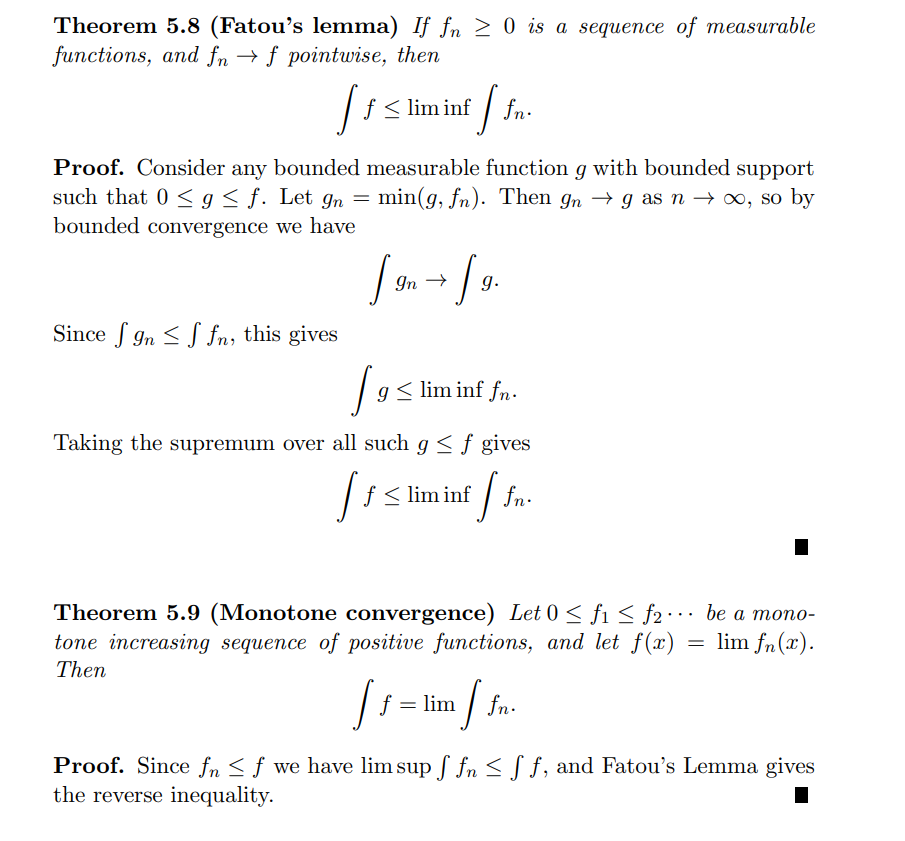
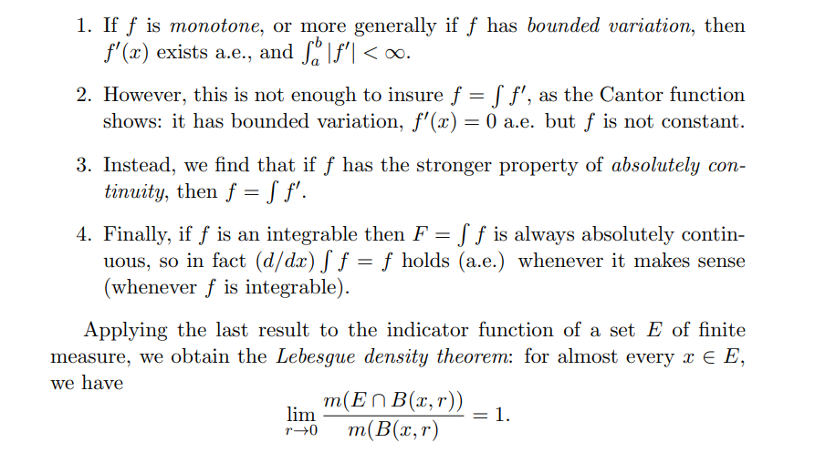
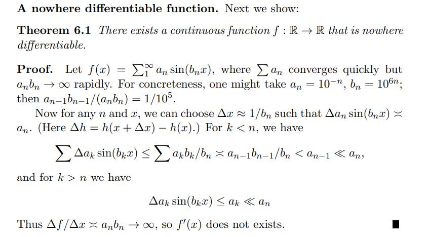
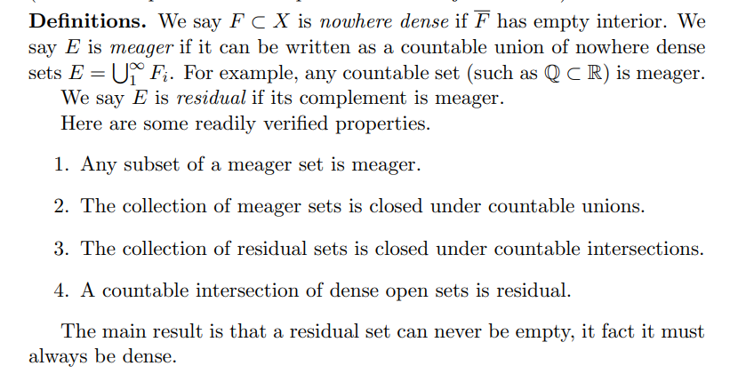

title: Basics
# Appendix: Undergrad Material

# Appendix: Undergrad Review

:::{.definition title="limsup"}
\[
\limsup x_{n}=\lim _{N \rightarrow \infty} \sup _{n>N} x_{n}
.\]
:::

:::{.example title="?"}
\envlist

- For $(x_n) \da \qty{n+1\over n}$, $\sup_n x_n = 2$ but $\limsup_n x_n = 1$.

:::

:::{.theorem title="Bounded Convergence"}

:::

A nowhere differentiable function:

Monotone functions are differentiable almost everywhere.

[[E-QSNCL]]

:::{.example title="?"}

:::

:::{.example title="A nowhere differentiable function"}
A nowhere differentiable function:

:::

:::{.fact}
Monotone functions are differentiable almost everywhere.

:::

[[P-HCA6D]]
