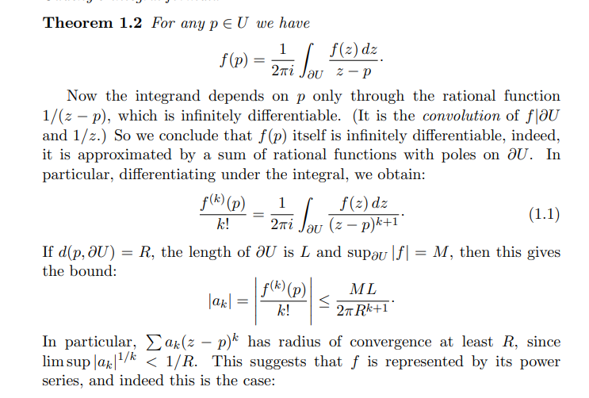
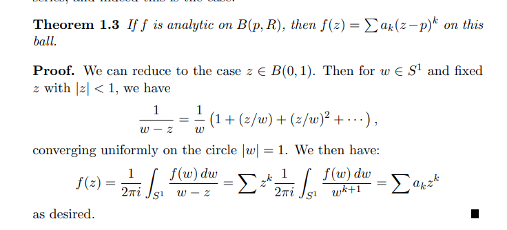
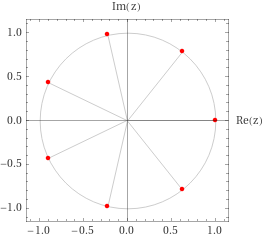
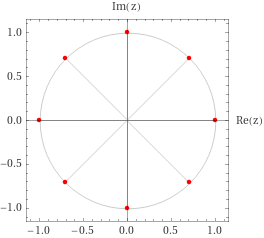
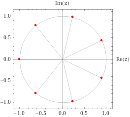
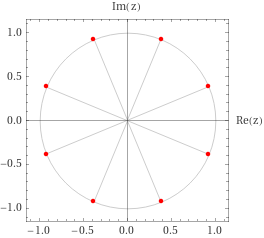

# Complex Preliminaries

:::{.fact}
Since $\CC$ is a field, $\CC[x]$ is a UFD.
:::

:::{.definition title="Toy contour"}
A closed Jordan curve that separates $\CC$ into an exterior and interior region is referred to as a **toy contour**.
:::

:::{.fact title="Complex roots of a number"}
The complex $n$th roots of $z \da r e^{i\theta}$ are given by
\[
\ts{ \omega_k \da r^{1/n} e^{i \qty{ \theta + 2k\pi \over n} } \st 0 \leq k \leq n-1 }
.\]
Note that one root is $r^{1/n}\in \RR$, and the rest are separated by angles of $2\pi/n$.
Mnemonic:
\[
z = re^{i\theta} = re^{i\qty{\theta + 2k\pi}} \implies z^{1/n} = \cdots
.\]
:::
## Complex Log
:::{.fact title="Complex Log"}
For $z= r e^{i\theta}\neq 0$, $\theta$ is of the form $\Theta + 2k\pi$ where $\Theta = \Arg z$
We define
\[
\log(z) = \ln\qty{\abs{z}} + i\Arg(z)
\]
and $z^c \da e^{c\log(z)}$.
Thus
\[
\log(re^{i\theta}) = \ln \abs{r} + i\theta
.\]
:::
:::{.fact}
Common trick:
\[
f^{1/n} = e^{{1\over n} \log(f)}
,\]
taking (say) a principal branch of $\log$ given by $\CC \sm (-\infty, 0] \cross 0$.
:::
:::{.proposition title="Existence of complex log"}
Suppose $\Omega$ is a simply-connected region such that $1\in \Omega, 0\not\in\Omega$.
Then there exists a branch of $F(z) \da \Log(z)$ such that

- $F$ is holomorphic on $\Omega$,
- $e^{F(z)} = z$ for all $z\in \Omega$
- $F(x) = \log(x)$ for $x\in \RR$ in a neighborhood of $1$.
:::
:::{.definition title="Principal branch and exponential"}
Take $\CC$ and delete $\RR^{\leq 0}$ to obtain the **principal branch** of the logarithm.
Equivalently, this is define for all $z=re^{i\theta}$ where $\theta \in (-\pi, \pi)$.

Here the log is defined as
\[
\Log(z) \da \log(r) + i\theta && \abs{\theta} < \pi
.\]
Similarly define
\[
z^{\alpha} \da e^{\alpha \Log(z)}
.\]
:::
:::{.warnings}
It's tempting to define
\[
z^{1\over n} \da (re^{i\theta})^{1\over n} = r^{1\over n} e^{i\theta \over n}
,\]
but this requires a branch cut to ensure continuity.

:::
:::{.remark}
Note the problem: for $z\da x+i0 \in \RR^{\leq 0}$, just above the axis consider $z_+ \da x + i\eps$ and $z_- \da x-i\eps$.
Then

- $\log(z_+) = \log\abs{x} + i\pi$, and
- $\log(z_-) = \log\abs{x} - i\pi$.

So $\log$ can't even be made continuous if one crosses the branch.
The issue is the **branch point** or **branch singularity** at $z=0$.
:::
- Since $\CC$ is a field, $\CC[x]$ is a UFD.
:::{.theorem title="Existence of log of a function"}
If $f$ is holomorphic and nonvanishing on a simply-connected region $\Omega$, then there exists a holomorphic $G$ on $\Omega$ such that
\[
f(z) = e^{G(z)}
.\]

:::
## Complex Calculus
:::{.remark}
When parameterizing integrals $\int_\gamma f(z)\dz$, parameterize $\gamma$ by $\theta$ and write $z=re^{i\theta}$ so $\dz = ire^{i\theta}\dtheta$.
:::
:::{.warnings}
$f(z) = \sin(z), \cos(z)$ are unbounded on $\CC$!
An easy way to see this: they are nonconstant and entire, thus unbounded by Liouville.

:::
:::{.example title="?"}
You can show $f(z) = \sqrt{z}$ is not holomorphic by showing its integral over $S^1$ is nonzero.
This is a direct computation:
\[
\int_{S^1} z^{1/2} \dz
&= \int_0^{2\pi} (e^{i\theta})^{1/2} ie^{i\theta} \dtheta \\
&= i \int_0^{2\pi} e^{i3\theta \over 2}\dtheta \\
&= i \qty{2\over 3i} e^{i3\theta \over 2}\evalfrom_{0}^{2\pi} \\
&= {2\over 3}\qty{e^{3\pi i - 1}} \\
&= -{4\over 3}
.\]

Note an issue: a different parameterization yields a different (still nonzero) number
\[
\cdots
&= \int_{-\pi}^{\pi} (e^{i\theta})^{1/2} ie^{i\theta} \dtheta \\
&= {2\over 3}\qty{ e^{3\pi i \over 2} - e^{-3\pi i \over 2}} \\
&= -{4i\over 3}
.\]
This is these are paths that don't lift to closed loops on the Riemann surface defined by $z\mapsto z^2$.
:::
### Holomorphy and Cauchy-Riemann
:::{.definition title="Analytic"}
A function $f:\Omega \to \CC$ is *analytic* at $z_0\in \Omega$ iff there exists a power series $g(z) = \sum a_n (z-z_0)^n$ with radius of convergence $R>0$ and a neighborhood $U\ni z_0$ such that $f(z) = g(z)$ on $U$.
:::
:::{.definition title="Complex differentiable / holomorphic /entire"}
A function $f: \CC\to \CC$ is **complex differentiable** or **holomorphic** at $z_0$ iff the following limit exists:
\[
\lim_{h\to 0} { f(z_0 + h) - f(h) \over h  }
.\]
A function that is holomorphic on $\CC$ is said to be **entire**.

Equivalently, there exists an $\alpha\in \CC$ such that
\[
f(z_0+h) - f(z_0) = \alpha h + R(h) && R(h) \converges{h\to 0}\too 0
.\]
In this case, $\alpha = f'(z_0)$.

:::
:::{.example title="Holomorphic vs non-holomorphic"}
\envlist

- $f(z) \da \abs{z}$ is not holomorphic.
- $f(z) \da \arg{z}$ is not holomorphic.
- $f(z) \da \Re{z}$ is not holomorphic.
- $f(z) \da \Im{z}$ is not holomorphic.
- $f(z) = {1\over z}$ is holomorphic on $\CC\smz$ but not holomorphic on $\CC$
- $f(z) = \bar{z}$ is *not* holomorphic, but is real differentiable:
\[
{f(z_0 + h) - f(z_0) \over h } = {\bar{z_0} + \bar h - \bar{z_0} \over h} = {\bar{h} \over h} = {re^{-i\theta} \over re^{i\theta}} = e^{-2i\theta} \converges{h\to 0}\too e^{-2i\theta}
,\]
which is a complex number that depends on $\theta$ and is thus not a single value.

:::
:::{.definition title="Real (multivariate) differentiable"}
A function $F: \RR^n\to \RR^m$ is **real-differentiable** at $\vector p$ iff there exists a linear transformation $A$ such that
\[
{ \norm{ F(\vector p + \vector h) - F(\vector p) - A(\vector h) } \over \norm{ \vector h } } \converges{\norm{\vector h}\to 0}\too 0
.\]
Rewriting,
\[
\norm{ F(\vector p + \vector h) - F(\vector p)  - A(\vector h) } = \norm{ \vector{h} } \norm{ R(\vector h) }
&& \norm{R(\vector h) }\converges{\norm{\vector h } \to 0}\too 0
.\]

Equivalently,
\[
F(\vector p + \vector h) - F(\vector p) = A(\vector h) + \norm{\vector h} R(\vector h) && \norm{R(\vector h) }\converges{\norm{\vector h } \to 0}\too 0
.\]

Or in a slightly more useful form,
\[
F(\vector p + \vector h) = F(\vector p) + A(\vector h) + R(\vector h) && R\in o( \norm{\vector h}), \text{ i.e. }
{ \norm{ R(\vector h) } \over  \norm{\vector h}} \converges{\vector h\to 0}\too 0
.\]
:::
:::{.proposition title="Complex differentiable implies Cauchy-Riemann"}
If $f$ is differentiable at $z_0$, then the limit defining $f'(z_0)$ must exist when approaching from any direction.
Identify $f(z) = f(x, y)$ and write $z_0 = x+ iy$, then first consider $h\in RR$, so $h = h_1 + ih_2$ with $h_2 = 0$.
Then
\[
f'(z_0) =
\lim_{h_1\to 0} { f(x+h_1, y) - f(x, y) \over h_1}
\da \dd{f}{x}(x, y)
.\]
Taking $h \in i\RR$ purely imaginary, so $h= ih_2$,
\[
f'(z_0)
= \lim_{ih_2\to 0} { f(x, y+h_2) - f(x, y) \over ih_2 } \da {1\over i} \dd{f}{y}(x, y)
.\]
Equating,
\[
\dd{f}{x} = {1\over i} \dd{f}{y}
,\]
and writing $f = u + iv$ and $1/i = -i$ yields
\[
\dd{f}{x} &= \dd{u}{x} + i \dd{v}{x} \\
{1\over i} \dd{f}{y} &= {1\over i} \qty{ \dd{u}{y} + i \dd{v}{y}} = \dd{v}{y} - i\dd{u}{y}
.\]
Thus
\[
\dd{u}{x} = \dd{v}{y} \hspace{8em} \dd{u}{y} = -\dd{v}{x}
.\]
:::
:::{.proposition title="Polar Cauchy-Riemann equations"}
\[
\frac{\partial u}{\partial r}=\frac{1}{r} \frac{\partial v}{\partial \theta} \quad \text { and } \quad \frac{1}{r} \frac{\partial u}{\partial \theta}=-\frac{\partial v}{\partial r}
.\]
:::
:::{.proof}
Setting
\[
z = re^{i\theta} = r(\cos(\theta) + i\sin(\theta) ) = x+iy
\]
yields $x=r\cos(\theta), y=r\sin(\theta)$, one can identify
\[
x_r = \cos(\theta)&, x_\theta = -r\sin(\theta) \\
y_r = \sin(\theta)&, y_\theta = r\cos(\theta)
.\]

Now apply the chain rule:
\[
u_r
&= u_x x_r + u_y y_r \\
&= v_y x_r -v_x y_r && \text{CR}\\
&= v_y \cos(\theta) - v_x \sin(\theta) \\
&= {1\over r}\qty{ v_y r\cos(\theta) - v_x r\sin(\theta) } \\
&= {1\over r}\qty { v_y y_\theta + v_x x_\theta} \\
&= {1\over r} v_\theta
.\]
Similarly,
\[
v_r
&= v_x x_r + v_y y_r \\
&= v_x \cos(\theta) + v_y\sin(\theta) \\
&= -u_y\cos(\theta) + u_x\sin(\theta) && \text{CR} \\
&= {1\over r}\qty{ -u_y r\cos(\theta) + u_x r\sin(\theta)} \\
&= {1\over r}\qty{ -u_y y_\theta - u_x x_0 } \\
&= -{1\over r} u_\theta
.\]

Thus
\[
\frac{\partial u}{\partial r}=\frac{1}{r} \frac{\partial v}{\partial \theta} \quad \text { and } \quad \frac{\partial v}{\partial r}=-\frac{1}{r} \frac{\partial u}{\partial \theta} \\
.\]

:::
:::{.proposition title="Holomorphic functions are continuous."}
$f$ is holomorphic at $z_0$ iff there exists an $a\in \CC$ such that
\[
f(z_0 + h) - f(z_0) - ah = h \psi(h), \quad \psi(h) \converges{h\to 0}\to 0
.\]
In this case, $a = f'(z_0)$.
:::
### Delbar and the Laplacian
:::{.definition title="del and delbar operators"}
\[
\del \da \del_z \da {1\over 2}\qty{\del_x - i \del_y}
\quad
\text{ and }
\quad
\delbar
\da \del_{\bar z}
={1\over 2}\qty{ \del_x + i\del_y}
.\]
Moreover, the 1-form corresponding to $f$ can be written as
\[
df = \del f + \delbar f = \dd{F}{z} \dz + \dd{F}{\zbar}\dzbar
.\]

Written slightly more explicitly:
\[
\dd{F}{z} = {1\over 2}\qty{\dd{F}{x} + {1\over i}\dd{F}{y} } &&
\dd{F}{\zbar} = {1\over 2}\qty{\dd{F}{x} - {1\over i}\dd{F}{y} }
.\]

:::
:::{.proposition title="Holomorphic iff delbar vanishes"}
$f$ is holomorphic at $z_0$ iff $\delbar f(z_0) = 0$:
\[
2\delbar f
&\da (\del_x + i \del_y) (u+iv) \\
&= u_x + iv_x + iu_y - v_y \\
&= (u_x - v_y) + i(u_y + v_x) \\
&= 0 && \text{by Cauchy-Riemann}
.\]
:::
### Harmonic Functions and the Laplacian
:::{.definition title="Laplacian and Harmonic Functions"}
A real function of two variables $u(x, y)$ is **harmonic** iff it is in the kernel of the Laplacian operator:
\[
\Delta u \definedas \qty{\dd{^2}{x^2} + \dd{^2}{y^2}}u = 0
.\]
:::
:::{.proposition title="Cauchy-Riemann implies holomorphic"}
If $f = u+iv$ with $u, v\in C^1(\RR)$ satisfying the Cauchy-Riemann equations on $\Omega$, then $f$ is holomorphic on $\Omega$ and
\[
f'(z) = \del f = {1\over 2}\qty{u_x + iv_x}
.\]
:::
:::{.proposition title="Holomorphic functions have harmonic components"}
If $f(z) = u(x, y) + iv(x, y)$ is holomorphic, then $u, v$ are harmonic.
:::
:::{.proof title="?"}
\envlist

- By CR,
\[
u_x = v_y && u_y = -v_x
.\]

- Differentiate with respect to $x$:
\[
u_{xx} = v_{yx} && u_{yx} = -v_{xx}
.\]
- Differentiate with respect to $y$:
\[
u_{xy} = v_{yy} && u_{yy} = -v_{xy}
.\]
- Clairaut's theorem: partials are equal, so
\[
u_{xx} - v_{yx} = 0 \implies u_{xx} + u_{yy} = 0 \\ \\
v_{xx} + u_{yx} = 0 \implies v_{xx} + v_{yy} = 0 \\ \\
.\]

:::
### Exercises
[[E-UVNVV]]
[[E-TVJFL]]
[[E-3QAC4]]
[[E-MTLQI]]
## Power Series

:::{.theorem title="Improved Taylor's Theorem"}
If $f$ is holomorphic on a region $\Omega$ with $\closure{ D_R(z_0)} \subseteq \Omega$, and for every $z\in D_r(z_0)$, $f$ has a power series expansion of the following form:
\[
f(z)=\sum_{n=0}^{\infty} a_{n}\left(z-z_{0}\right)^{n} \quad\text{ where } a_{n}=\frac{f^{(n)}\left(z_{0}\right)}{n !}
= {1 \over 2\pi r^n}\int_0^{2\pi} f(z_0 + re^{i\theta})e^{-in\theta} \dtheta
.\]
:::
:::{.proposition title="Power Series are Smooth"}
Any power series is smooth (and thus holomorphic) on its disc of convergence, and its derivatives can be obtained using term-by-term differentiation:
\[
\dd{}{z} f(z) = \dd{}{z} \sum_{k\geq 0} c_k (z-z_0)^k = \sum_{k\geq 1} kc_k (z-z_0)^k
.\]
Moreover, the coefficients are given by
\[
c_k = {f^{(n)}(z_0) \over n! }
.\]
:::
:::{.remark}
By an application of the Cauchy integral formula (see S&S 7.1) if $f$ is holomorphic on $D_R(z_0)$ there is a formula for all $k\geq 0$ and all $0<r<R$:
\[
c_k = {1\over 2\pi r^k} \int_0^{2\pi} f(z_0 + re^{i\theta}) e^{-in\theta}\dtheta
.\]
:::
:::{.proposition title="Exponential is uniformly convergent in discs"}
$f(z) = e^z$ is uniformly convergent in any disc in $\CC$.
:::
:::{.proof}
Apply the estimate
\[
\abs{e^z} \leq \sum {\abs {z}^n \over n!} = e^{\abs{z}}
.\]
Now by the $M\dash$test,
\[
\abs{z} \leq R < \infty \implies \abs{\sum {z^n \over n!}} \leq e^R < \infty
.\]
:::
:::{.lemma title="Dirichlet's Test"}
Given two sequences of real numbers \( \ts{ a_k } , \ts{ b_k } \) which satisfy

1. The sequence of partial sums \( \ts{ A_n } \) is bounded,
2. $b_k \searrow 0$.

then
\[
\sum_{k\geq 1} a_k b_k < \infty
.\]
:::
:::{.proof title="?"}

> See <http://www.math.uwaterloo.ca/~krdavids/Comp/Abel.pdf>

Use summation by parts.
For a fixed $\sum a_k b_k$, write
\[
\sum_{n=1}^m x_n Y_n + \sum_{n=1}^m X_n y_{n+1} = X_m Y_{m+1}
.\]
Set $x_n \da a_n, y_N \da b_n - b_{n-1}$, so $X_n = A_n$ and $Y_n = b_n$ as a telescoping sum.
Importantly, all $y_n$ are negative, so $\abs{y_n} = \abs{b_n - b_{n-1}} = b_{n-1} - b_n$, and moreover $a_n b_n = x_n Y_n$ for all $n$.
We have
\[
\sum_{n\geq 1} a_n b_n
&= \lim_{N\to\infty} \sum_{n\leq N} x_n Y_n \\
&= \lim_{N\to\infty} \sum_{n\leq N} X_N Y_N - \sum_{n\leq N} X_n y_{n+1} \\
&= - \sum_{n\geq 1} X_n y_{n+1},
\]
where in the last step we've used that
\[
\abs{X_N} = \abs{A_N}\leq M \implies \abs{X_N Y_{N} } = \abs{X_N} \abs{b_{n+1}} \leq M b_{n+1} \to 0
.\]
So it suffices to bound the latter sum:
\[
\sum_{k\geq n}\abs{ X_k y_{k+1} }
&\leq M \sum_{k\geq 1} \abs{y_{k+1}}\\
&\leq M \sum_{k\geq 1} b_{k} - b_{k+1} \\
&\leq 2M(b_1 - b_{n+1})\\
&\leq 2M b_1
.\]

:::
:::{.theorem title="Abel's Theorem"}
If $\sum_{k=1}^\infty c_k z^j$ converges on $\abs{z} < 1$ then
\[
\lim_{z\to 1^-} \sum_{k\in \NN} c_k z^k = \sum_{k\in \NN} c_k
.\]
:::
:::{.lemma title="Abel's Test"}
If $f(z) \da \sum c_k z^k$ is a power series with $c_k \in \RR^{\geq 0}$ and $c_k\decreasesto 0$, then $f$ converges on $S^1$ except possibly at $z=1$.
:::
:::{.example title="application of Abel's theorem"}
What is the value of the alternating harmonic series?
Integrate a geometric series to obtain
\[
\sum {(-1)^k z^k \over n} = \log(z+1) && \abs{z} < 1
.\]
Since $c_k \da (-1)^k/k \decreasesto 0$, this converges at $z=1$, and by Abel's theorem $f(1) = \log(2)$.

:::
:::{.remark}
The converse to Abel's theorem is false: take $f(z) = \sum  (-z)^n = 1/(1+z)$.
Then $f(1) = 1-1+1-\cdots$ diverges at 1, but $1/1+1 = 1/2$.
So the limit $s\da \lim_{x\to 1^-} f(x) 1/2$, but $\sum a_n$ doesn't converge to $s$.
:::
:::{.proposition title="Summation by Parts"}
Setting $A_n \da \sum_{k=1}^n b_k$ and $B_0 \da 0$,
\[
\sum_{k=m}^n a_k b_k
&= A_nb_n - A_{m-1} b_m - \sum_{k=m}^{n-1} A_k(b_{k+1} - b_{k})
.\]
Compare this to integrating by parts:
\[
\int_a^b f g = F(b)g(b) - F(a)g(a) - \int_a^b Fg'
.\]

Note there is a useful form for taking the product of sums:
\[
A_{n} B_{n}=\sum_{k=1}^{n} A_{k} b_{k}+\sum_{k=1}^{n} a_{k} B_{k-1}
.\]

:::
:::{.proof title="?"}
An inelegant proof: define $A_n \da \sum_{k\leq n} a_k$, use that $a_k = A_k - A_{k-1}$, reindex, and peel a top/bottom term off of each sum to pattern-match.
\

Behold:
\[
\sum_{m\leq k \leq n} a_k b_k
&= \sum_{m\leq k \leq n} (A_k - A_{k-1}) b_k \\
&= \sum_{m\leq k \leq n} A_kb_k - \sum_{m\leq k \leq n} A_{k-1} b_k \\
&= \sum_{m\leq k \leq n} A_kb_k - \sum_{m-1\leq k \leq n-1} A_{k} b_{k+1} \\
&= A_nb_n + \sum_{m\leq k \leq n-1} A_kb_k - \sum_{m-1\leq k \leq n-1} A_{k} b_{k+1} \\
&= A_nb_n - A_{m-1} b_{m} + \sum_{m\leq k \leq n-1} A_kb_k - \sum_{m\leq k \leq n-1} A_{k} b_{k+1} \\
&= A_nb_n - A_{m-1} b_{m} + \sum_{m\leq k \leq n-1} A_k(b_k - b_{k+1}) \\
&= A_nb_n - A_{m-1} b_{m} - \sum_{m\leq k \leq n-1} A_k(b_{k+1} - b_{k})
.\]

:::
:::{.proposition title="?"}
If $f$ is non-constant, then $f'$ is analytic and the zeros of $f'$ are isolated.
If $f,g$ are analytic with $f'=g'$, then $f-g$ is constant.
:::
### Exercises: Series
[[E-ZWNTH]]
[[E-BUVLS]]
[[E-VCLTY]]
[[E-THK2Z]]
[[E-ORJPT]]

:::{.fact title="Complex roots of a number"}
Derivation of complex $n$th roots of a complex number $z$: 
\[
z = re^{i\theta} = re^{i\qty{\theta + 2k\pi}} \implies z^{1/n} = 
\qty{ re^{i\qty{\theta + 2k\pi}} }^{1\over n} = r^{1\over n} e^{i\qty{\theta + 2k\pi \over n}}
\leadsto
\ts{ \omega_k \da r^{1/n} e^{i \qty{ \theta + 2k\pi \over n} } \st 0 \leq k \leq n-1 }
.\]
Note that one root is $r^{1/n}\in \RR$, and the rest are separated by angles of $2\pi/n$.
:::

## Complex Factoring

:::{.fact title="A complex perspective on factoring"}
For $f$ a quadratic, writing $\Delta \da b^2-4ac$, the roots take on the form
\[
z_k = {1\over 2a}\qty{-b + i\sqrt{-\Delta}} = {1\over 2a}\qty{-b + i\sqrt{4ac - b^2}}
.\]
For monic polynomials, this becomes slightly nicer:
\[
z_k = {1\over 2}\qty{-b + i\sqrt{4c-b^2} }
.\]
:::

:::{.example title="Factoring a quadratic"}
There is a slightly nicer way to find roots, e.g.:
\[
x^2 + 2x + 6 &= 0 \\
\implies x^2 + 2x + 1 + 4 &= 0 \\
\implies (x+1)^2 + 4 &= 0 \\
\implies x+1 &= \pm 2i \\
\implies x &= -1\pm 2i
.\]
:::

:::{.fact title="Factoring $z^n-1$"}
\[
z^n-1 
&= \prod_{k=0}^{n-1} (z-\zeta_n^k) 
= (z-1)(z-\zeta_n)(z-\zeta_n^2)\cdots(z-\zeta_n^{n-1}) && \zeta_n \da e^{2\pi i \over n}
.\]

What the roots look like: 

- $n$ odd:

- $n$ even: $\theta_0=0$, increment by $2\pi/n$. 
Always have $\pm 1$.

:::

:::{.fact title="Factoring $z^n-w$ for $w\in \CC$"}
Write $w=Re^{i\theta}$, then 
\[
z^n = w \implies z = R^{1\over n}e^{i(\theta + 2k\pi )\over n} = R^{1\over n}e^{i\theta\over n}e^{2\pi i k \over n} = \qty{Re^{i\theta}}^{1\over n}\zeta_n^k
.\]
Thus setting $w_0 \da (Re^{i\theta})^{1\over n}$ yields
\[
z^n - w = \prod_{k=0}^{n-1} (z-w_0\zeta_n^k) = (z-w_0)(z-w_0\zeta_n)\cdots (z-w_0\zeta_n^{n-1})
.\]

:::

:::{.fact title="Factoring $z^n+1$"}
Factoring $z^n+1$:
write $1 = e^{i\pi}$ to get $w_0 \da e^{i\pi \over n}$, then
\[
z^n+1 
= \prod_{k=0}^{n-1}(z-w_0\zeta_k)
&= 
(z-e^{i\pi \over n}e^{2i\pi  \over n})
(z-e^{i\pi \over n}e^{4i\pi  \over n})
\cdots
(z-e^{i\pi \over n}e^{2(n-1)i \pi \over n}) \\
&=
(z - e^{3i\pi \over n})(z-e^{5i\pi \over n}) \cdots
(z - e^{(2n-1)i\pi \over n})
.\]

What the roots look like:

- $n$ odd: start at $\theta_0 = \pi$, increment by $2\pi/n$.

- $n$ even: start at $\theta_0 = \pi/n$, increment by $2\pi/n$.

:::

# Preliminaries
- Since $\CC$ is a field, $\CC[x]$ is a UFD.
