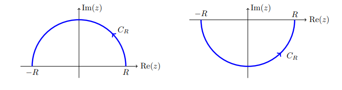
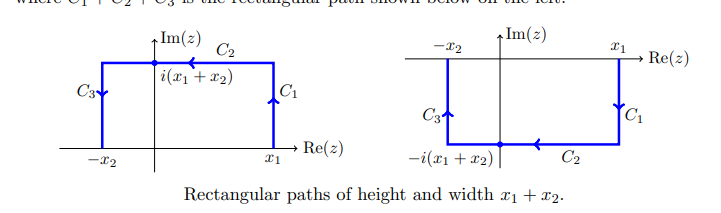

# Integrals

[See this very detailed note](https://math.mit.edu/~jorloff/18.04/notes/topic9.pdf).

- For integrals that decay faster than $1/z^\alpha, \alpha>1$: semicircular contours.

  

- For integrals that decay like $1/z$: rectangular contours.

- If a trigonometric function is in the numerator, check if $I \approx \Re(\tilde I)$ where $\tilde I$ replaces cosines/sines with $e^{iz}$.

- For rational functions of $\cos, \sin$: set $2\cos(z) = z + z\inv, 2\sin(z) = z - z\inv, \dtheta = {\dz\over iz}$ to reduce to a residue count in $\abs{z} \leq 1$.

[[E-CFHC4]] [[E-JK5PG]] [[E-FRWVZ]] [[E-2RKYE]]
## Branch Cuts

[[E-22P3T]] [[E-Z66NC]]
