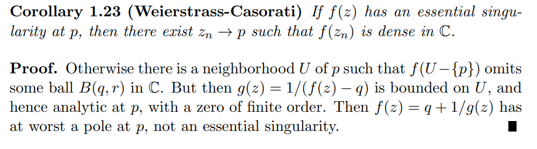

# Casorati-Weierstrass

:::{.theorem title="Casorati-Weierstrass" ref="Casorati"}
If $f$ is holomorphic on $\Omega\setminus\theset{z_0}$ where $z_0$ is an essential singularity, then for every $V\subset \Omega\setminus\theset{z_0}$, $f(V)$ is dense in $\CC$.

Equivalently, suppose $z_{0}$ is an essential isolated singularity of $f(z)$. Then for every complex number $w_{0}$, there is a sequence $z_{n} \rightarrow z_{0}$ such that $f\left(z_{n}\right) \rightarrow w_{0}$.

:::

:::{.slogan}
The image of a punctured disc at an essential singularity is dense in $\CC$.
:::

:::{.proof title="of Casorati-Weierstrass"}
Let $f$ have an essential singularity.
Suppose toward a contradiction that there exists a $z_0\in \CC$, a punctured neighborhood $\Omega$ of $z_0$, and $\eps > 0$ with $f(\Omega) \intersect \DD_\eps(z_0)$ empty.
So $\abs{f(z) - z_0}>\eps$ for every $z\in \Omega$.
Write $\tilde \Omega \da \Omega\union\ts{z_0}$.

Define $g(z) \da {1\over f(z) - z_0}$, noting that $z_0$ is the only singularity of $g$ in $\tilde\Omega$, making $g$ holomorphic on $\Omega$.
We have $\abs{g(z)} < \eps\inv < \infty$ for all $z\in \Omega$, so $g$ is bounded in $\Omega$ and $z_0$ must be a removable singularity.
By Riemann's removable singularity theorem, $g$ extends to a holomorphic function on all of $\tilde\Omega$.

We can now write $f(z) = {1\over g(z)} + z_0$.
If $g(z_0) = 0$, then it is a zero of some finite order for $g$, and thus a pole of finite order for $f$, contradicting that $z_0$ is essential for $f$.
Otherwise, if $g(z_0) = w_0\neq 0$, then 
\[
\abs{ f(z_0)} = \abs{ {1\over w_0} + z_0} \leq \eps + \abs{z_0} < \infty
,\]
making $z_0$ removable and again yielding a contradiction.
:::

:::{.proof title="of Casorati-Weierstrass, Gamelin"}
Pick $w\in \CC$ and suppose toward a contradiction that $D_R(w) \intersect f(V)$ is empty.
Consider
\[
g(z) \da {1\over f(z) - w}
,\]
and use that it's bounded to conclude that $z_0$ is either removable or a pole for $f$.

In detail, from Gamelin:

:::

# Exercises

[[E-HEJJK]]

[[E-3ZHRE]]

[[E-27X7K]]

