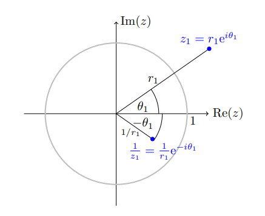

# Complex Arithmetic

## Spring 2020 HW 1 # 1
[[P-TWN5M]]

## Spring 2020 HW 1 # 2
[[P-3HHKX]]

## Spring 2020 HW 1 # 3
[[P-43AXY]]

## Spring 2020 HW 1 # 4
[[P-CZ3R7]]

## Spring 2020 HW 1 # 5
[[P-FOXHV]]

## Spring 2020 HW 1 # 6
[[P-37Z7J]]

## Spring 2020 HW 1 # 11
[[P-UYWZ5]]

## Holomorphicity

## Spring 2020 HW 1 # 7
[[P-CV2MR]]

## Spring 2020 HW 1 # 8
[[P-7UTDI]]

## Spring 2020 HW 1 # 9
[[P-TFO34]]

### Spring 20202 HW 2 #  2.6.10
[[P-U2ZP6]]

### Spring 20202 HW 2 #  2.6.13
[[P-4YOJC]]

### Spring 20202 HW 2 #  2.6.14
[[P-YEZTR]]

### Spring 20202 HW 2 #  1
[[P-7UIYI]]

### Spring 20202 HW 2 #  2
[[P-FOYTY]]

### Spring 20202 HW 2 #  3
[[P-F7HCN]]

### Spring 20202 HW 2 #  5
[[P-LLNJ7]]

:::{.fact title="The balancing exponentials trick"}
There are formulas:
\[
&e^{a i \omega}+e^{b i \omega}
&=2 \cos \left(\frac{a-b}{2} \omega\right) e^{\frac{a+b}{2} i \omega} \\
e^{a i \omega}-e^{b i \omega}
&=2 i \sin \left(\frac{a-b}{2} \omega\right) e^{\frac{a+b}{2} i \omega}
.\]
Why this is useful: you can reduce a sum of two exponentials to a complex scalar times a real trig function, e.g. when computing a residue to get a real number.
Why this is true: for the right choice of $\ell$,
\[
e^{aiw} + e^{biw} = e^{\ell iw} \qty{ e^{(l-a)iw} + e^{(\ell - b)iw} } = e^{\ell i w} \qty{ e^{kiw} + e^{-kiw}} = e^{\ell i w}\cdot 2\cos(kw)
.\]
To make this hold, choose

- $\ell \da {a+b\over 2}$
- Then $\ell - a = {b-a \over 2} \da k$
- $\ell -b = {a-b\over 2} = -k$

An example:
\[
e^{-i\pi \over 2}+ e^{-3i\pi \over 2} 
&\da e^{-iw} + e^{-3iw} \\
&= e^{-2iw} \qty{e^{iw} + e^{-iw}}\\
&= e^{-2iw}\cdot 2\cos(w) \\
&= e^{-2i\cdot {\pi \over 2}}\cdot 2\cos\qty{\pi \over 2} \\
&= -i\cdot 0 = 0
.\]

:::

:::{.fact title="Some useful facts about basic complex algebra"}
\[
z + \bar{z} &= 2\Re(z) 
&& 
z - \bar{z} = 2i\Im(z) \\
z\bar z &= \abs{z}^2 
&& 
\Arg(z/w) = \Arg(z) - \Arg(w) \\
\Re(z) &= { z + \bar z \over 2} 
&& 
\Im(z) = {z - \bar{z} \over 2i} \\
{1\over i} &= -i = i^3 &&
{1\over i^3} = i
.\]

Exponential forms of cosine and sine, where it's sometimes useful to set $w\da e^{iz}$:
\[
\cos(z) 
&= \frac 1 2 \qty{e^{iz} + e^{-iz}} = {1\over 2}(w+ w\inv)\\
\sin(z) 
&= \frac{1}{2i}\qty{e^{iz} - e^{-iz}} = {1\over 2i}(w-w\inv)
.\]

Exponential forms of *hyperbolic* cosine and sin:
\[
\cosh(z) 
&= \cos(iz) 
= {1\over 2}\qty{e^z + e^{-z}} \\
\sinh(z) 
&= -i \sin(iz) 
= {1\over 2}\qty{e^z - e^{-z}} 
.\]

Some other useful facts about the hyperbolic exponentials:

- They are periodic with period $2\pi i$.
- $\dd{}{z}\cosh(z) = \sinh(z)$ and $\dd{}{z}\sinh(z) = \cosh(z)$.
- $\sinh$ is odd and $\cosh$ is even.
- $\cosh(z + i\pi) = -\cosh(z)$ and $\sinh(z + i\pi) = -\sinh(z)$.
- $\cosh$ has zeros at $\ts{i\pi\qty{2k+1\over 2}} = \ts{i \qty{\pi/2 + k\pi}}$, i.e. $\cdots, -\pi/2, \pi/2, 3\pi/2,\cdots$, the half-integers.
- $\sinh$ has zeros at $\ts{i\pi k}$, i.e. the integers.
- $\sinh(z)$ has a particularly nice formula for derivatives:
\[
f(z) &\da \cosh(z) \implies f^{(n)}(z) = {e^z + (-1)^n e^{-z}\over 2} \\
f(z) &\da \sinh(z) \implies f^{(n)}(z) = {e^z - (-1)^{n} e^{-z}\over 2} 
.\]

:::

:::{.fact}
Some computations that come up frequently:
\[
\abs{z \pm w}^2 &= \abs{z}^2 + \abs{w}^z + 2\Re(\bar{w}z) \\
(a+bi)(c+di) &= (ac - bd) + (ad + bc) \\
{1\over \abs{a+b}} &\leq {1 \over {\abs a - \abs b}} &&
\abs{e^{z}} = e^{\Re(z)}, \quad \arg(e^z) = \Im(z)
.\]

:::

:::{.fact}
The inversion $z\to 1/z$ is easiest to understand in polar coordinates, $Re^{i\theta}\mapsto {1\over R}e^{-i\theta}$:

:::

## Exercises

[[E-X4MBB]]

[[E-WNNSK]]

[[E-P7SIB]]
[[E-JWO2G]]

[[E-ZCPKK]]
