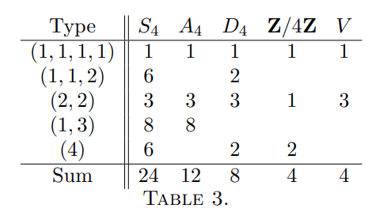
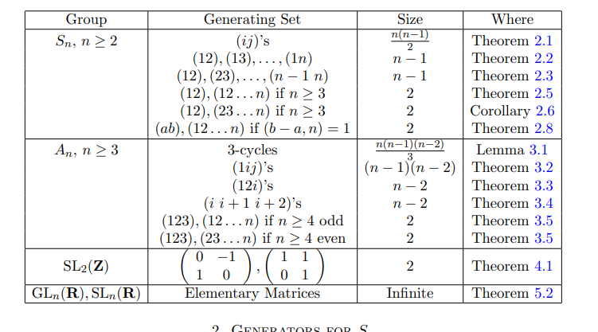

# Compute this Galois group

Throughout, $f \in \QQ[x]$ is separable of degree $n$ with roots $r_1,\ldots,r_n$, and $G = \Gal(\SF(f)/\QQ)$, which acts faithfully on the roots and so embeds in $S_n$.
The group $G$ is determined by combining upper bounds (the transitive subgroups of $S_n$, the discriminant) with elements exhibited in $G$ (cycle types from reduction modulo primes, complex conjugation).

Galois theory exercises with solutions: [chapter 4](https://feog.github.io/chap4.pdf).

## Degree bounds

- $\size{G} = [\SF(f):\QQ]$.
- If $f$ is irreducible, $G$ acts transitively on the roots, so by orbit-stabilizer $n = \size{\Orb(r_1)} = [G:\Stab_G(r_1)]$ divides $\size G$, and
  $$
  n\divides \size G \divides n!.
  $$
- For each root $r_i$, $[\QQ(r_i):\QQ]$ divides $[\SF(f):\QQ]$.

[[PR-LXSGE]]

## Transitive subgroups of $S_n$

::: {.fact title="Transitive subgroups of $S_n$ for $n\leq 5$"}
Write $C_n$ for the cyclic group of order $n$.

| $n$ | Transitive subgroups of $S_n$ up to conjugacy | Orders | Nonabelian |
| --- | --- | --- | --- |
| $1$ | $1$ | $1$ | none |
| $2$ | $S_2 \cong C_2$ | $2$ | none |
| $3$ | $S_3\cong D_3$, $A_3 \cong C_3$ | $6$, $3$ | $S_3$ |
| $4$ | $S_4$, $A_4$, $D_4$, $C_4$, $C_2^2$ | $24$, $12$, $8$, $4$, $4$ | $S_4$, $A_4$, $D_4$ |
| $5$ | $S_5$, $A_5$, $F_5\cong C_5\semidirect C_4$, $D_5$, $C_5$ | $120$, $60$, $20$, $10$, $5$ | $S_5$, $A_5$, $F_5$, $D_5$ |

Here $\size{D_n} = 2n$, $\size{S_n} = n!$, $\size{A_n} = n!/2$, and $F_5$ has presentation $\gens{a,b \st a^5, b^4, bab\inv = a^2}$.

The quaternion group
$$
Q_{8}=\left\langle\alpha, \beta \mid \alpha^{4}=\beta^{4}=1, \alpha \beta \alpha=\beta, \beta^{2}=\alpha^{2}\right\rangle
$$
is a transitive subgroup of $S_8$ via its regular action, and it is not isomorphic to a subgroup of $S_m$ for any $m<8$.
:::

## The discriminant

[[D-W3DSO]]

For monic $f$, the discriminant is $\Delta_f = \prod_{i<j}(r_i - r_j)^2$, a product of $n(n-1)/2$ factors, and $\Delta_f\neq 0$ because $f$ is separable.
Then
$$
G \subseteq A_n \iff \sqrt{\Delta_f} \in \QQ.
$$

::: {.remark title="Formulas"}
- For $f = ax^2+bx+c$, $\Delta = b^2-4ac$.
- For $f = ax^3+bx^2+cx+d$, $\Delta = b^2c^2 - 4ac^3 - 4b^3d - 27a^2d^2 + 18abcd$.
  For $a=1$, the substitution $x = t - b/3$ gives $t^3+pt+q$, with the same discriminant $\Delta = -4p^3-27q^2$.
- $\Delta_f = 0$ if and only if $f$ has a repeated root.
:::

## Cycle types from reduction modulo $p$

[[PR-XDWOP]]

::: {.warnings}
Dedekind's theorem applies only to primes $p$ not dividing the leading coefficient for which $f \bmod p$ is squarefree.
:::

For such a prime $p$, if $f \bmod p$ factors into irreducibles of degrees $d_1,\ldots,d_k$, then $G$ contains an element of cycle type $(d_1,\ldots,d_k)$.

::: {.example title="A transposition and a $5$-cycle"}
Let $f$ be irreducible of degree $5$ with exactly two nonreal roots.
Complex conjugation restricts to a transposition $\tau\in G$, and $5\divides\size G$, so $G$ contains a $5$-cycle $\sigma$.
Some power of $\sigma$ sends the first point of $\tau$ to the second, so after replacing $\sigma$ by that power and relabeling the roots, $\tau = (1,2)$ and $\sigma = (1,2,3,4,5)$.
Then $\sigma\tau\sigma\inv = (2,3)$ and $(1,2)(2,3) = (1,2,3)$, so $3\divides\size G$.
Hence $\size G$ is divisible by $30$, which excludes $F_5$, $D_5$, and $C_5$; since $\tau$ is odd, $G\neq A_5$, and $G=S_5$.
:::

::: {.example title="Cycle types for $x^5+2x+1$"}
$f(x) = x^5+2x+1$ is irreducible modulo $3$, so $f$ is irreducible over $\QQ$ and $G$ contains a $5$-cycle.
Modulo $17$, $f$ factors into irreducibles of degrees $2$ and $3$, so $G$ contains an element $\rho$ of cycle type $(2,3)$, and $\rho^3$ is a transposition.
A subgroup of $S_5$ containing a $5$-cycle and a transposition is $S_5$, so $G = S_5$.
:::

::: {.example title="$x^4+x+1$"}
$f(x) \da x^4+x+1$ is irreducible modulo $2$, so $f$ is irreducible over $\QQ$ and $G$ contains a $4$-cycle.
Modulo $3$, $f$ factors into irreducibles of degrees $1$ and $3$, so $G$ contains a $3$-cycle.
Hence $12\divides\size G$, and $G$ contains the odd permutation given by the $4$-cycle, so $G = S_4$.
:::

::: {.example title="A transposition from a power"}
$f(x) = x^6+x^4+x+3$ factors modulo $11$ into irreducibles of degrees $1$ and $5$, and modulo $7$ into irreducibles of degrees $2$ and $4$.
The only factorization type over $\QQ$ compatible with both is a single factor of degree $6$, so $f$ is irreducible and $G$ is transitive.
$G$ contains a $5$-cycle fixing one root, so the stabilizer of that root is transitive on the other five roots, and $G$ is $2$-transitive, hence primitive.
Modulo $2$, $f$ factors into irreducibles of degrees $1$, $2$, and $3$, and $\qty{(a,b)(c,d,e)}^3 = (a,b)$ is a transposition in $G$.
A primitive subgroup of $S_n$ containing a transposition is $S_n$, so $G = S_6$.

Similarly, $x^7-x-1$ is irreducible modulo $2$ and factors modulo $3$ into irreducibles of degrees $2$ and $5$; the fifth power of an element of type $(2,5)$ is a transposition, and a subgroup of $S_7$ containing a $7$-cycle and a transposition is $S_7$.
:::

## Distinguishing the remaining candidates

::: {.remark title="Criteria for $n = 4$ and $n=5$"}
$n=4$:

- $C_4$ contains a $4$-cycle and $C_2^2$ does not; both contain elements of type $(2,2)$.
- $A_4$ contains no transposition and no $4$-cycle, so either one in $G$ excludes $A_4$; the discriminant separates $S_4$ from $A_4$.

$n=5$ and general $n$:

- A subgroup of $S_5$ containing a transposition and a $5$-cycle is $S_5$.
- $S_n = \gens{(a,b), (1,2,\ldots,n)}$ if and only if $\gcd(b-a, n) = 1$.
:::

[[PR-5PI25]]

::: {.remark title="Parity"}
\envlist

- A permutation lies in $A_n$ if and only if it has an even number of cycles of even length.
- $A_4$ contains no transposition and no $4$-cycle.
:::

::: {.fact title="Subgroups of $S_4$"}

:::

::: {.fact title="Generating sets"}
Generating sets for $S_n$ and $A_n$: [Keith Conrad, Generating sets](https://kconrad.math.uconn.edu/blurbs/grouptheory/genset.pdf).

:::

## Structural facts

::: {.fact title="Structural facts"}
\envlist

- If $f = f_1\cdots f_k$ with the $f_i$ irreducible, then $G$ permutes the roots of each $f_i$ among themselves, so $G$ embeds in $\prod_i\Gal(\SF(f_i)/\QQ)$.
- If $\SF(f)$ contains a subfield that is not normal over $\QQ$, then $G$ is nonabelian.
  For $f = x^3-2$, $\SF(f) = \QQ(\zeta_3, 2^{1/3})$ contains the non-normal subfield $\QQ(2^{1/3})$, so $G = S_3$.
- If $f$ has exactly $k$ pairs of nonreal roots, complex conjugation restricts to an element of $G$ that is a product of $k$ disjoint transpositions.
- If every exponent in $f$ is even, the roots come in pairs $\pm r$, and $G$ permutes these pairs; for example, $x^4-5x^2+5$ has Galois group $C_4$.
- For positive integers $a\neq b$, $\QQ(\zeta_a) = \QQ(\zeta_b)$ if and only if one of $a,b$ is odd and the other is twice it.
- If $f = a_nx^n + \cdots + a_0\in\ZZ[x]$ and $p/q$ is a rational root in lowest terms, then $p \divides a_0$ and $q\divides a_n$.

Subgroup lattices of small groups: [Groups of small order](https://hobbes.la.asu.edu/groups/groups.html).
:::

::: {.remark title="Degrees and indices"}
For a finite Galois extension $L/F$ with $G = \Gal(L/F)$ and an intermediate field $K$ corresponding to $H = \Gal(L/K)$,
$$
[L:K] = \size H, \qquad [K:F] = [G:H], \qquad [L:F] = \size G.
$$
:::
