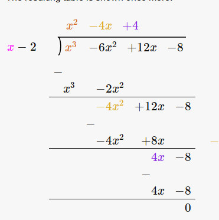

# Undergraduate review

::: {.fact title="Determinants"}
For an $n\times n$ matrix $A=(a_{ij})$,
$$
\det A = \sum_{\sigma \in S_n} \sgn(\sigma) \prod_{i=1}^n a_{i, \sigma(i)}.
$$
For $n=3$,
$$
\det\left(\begin{array}{ccc}
a_{11} & a_{12} & a_{13} \\
a_{21} & a_{22} & a_{23} \\
a_{31} & a_{32} & a_{33}
\end{array}\right)=\begin{gathered}
a_{11} a_{22} a_{33}+a_{12} a_{23} a_{31}+a_{13} a_{21} a_{32} \\
-a_{13} a_{22} a_{31}-a_{12} a_{21} a_{33}-a_{11} a_{23} a_{32}
\end{gathered}.
$$

Let $\minor_A(i, j)$ denote the matrix obtained from $A$ by deleting row $i$ and column $j$.
Expansion along row $i$ gives
$$
\det(A) = \sum_{j=1}^n (-1)^{i+j} a_{ij} \det \minor_A(i, j),
$$
and if $\det A$ is invertible, the adjugate gives the inverse:
$$
A\inv = {1\over \det A} \adj(A), \qquad \adj(A)_{ij} \da (-1)^{i+j} \det \minor_A(j, i).
$$
:::

::: {.fact title="Eigenvalues, trace, and determinant"}
The eigenvalues of an upper-triangular matrix are its diagonal entries, and its determinant is their product.
If the characteristic polynomial of $A$ splits, with eigenvalues $\lambda_1,\ldots,\lambda_n$ listed with multiplicity, then $\tr(A) = \sum_i \lambda_i$ and $\det(A) = \prod_i \lambda_i$, and more generally
$$
\chi_A(t) = t^n - \qty{\sum_i \lambda_i }t^{n-1} + \qty{\sum_{i < j} \lambda_i \lambda_j }t^{n-2} - \cdots + (-1)^n\qty{\prod_i \lambda_i}.
$$
Since $\tr(AB) = \tr(BA)$, similar matrices have equal traces: $\tr(PJP\inv) = \tr(P\inv PJ) = \tr(J)$.
:::

::: {.fact title="Block multiplication"}
For block matrices whose block sizes make each product below defined,
$$
\begin{bmatrix}
A & B \\
C & D
\end{bmatrix}
\begin{bmatrix}
E & F \\
G & H
\end{bmatrix}
= \matt{AE + BG}{AF + BH}{CE + DG}{ CF + DH}.
$$
:::

::: {.fact title="Powers of an upper-triangular matrix"}
If $A$ is upper triangular, the diagonal entries of $A^k$ are the $k$th powers of the diagonal entries of $A$:
$$
A\da\left(\begin{array}{ccc}
a_1 & & * \\
& \ddots & \\
0 & & a_n
\end{array}\right)
\implies
A^k = \left(\begin{array}{ccc}
a_1^k & & * \\
& \ddots & \\
0 & & a_n^k
\end{array}\right).
$$
By induction on $k$: a product of upper-triangular matrices is upper triangular, and its $i$th diagonal entry is the product of the $i$th diagonal entries of the factors.
:::

::: {.example title="Polynomial long division"}
For $f(x) \da x^3-6x^2+12x-8$, every rational root lies in $\ts{\pm 8, \pm 4, \pm 2, \pm 1}$.
Since $f(2) = 0$, divide by $x-2$:

The quotient is $x^2-4x+4 = (x-2)^2$, so
$$
f(x) = (x-2)(x^2-4x+4) = (x-2)^3.
$$
:::
