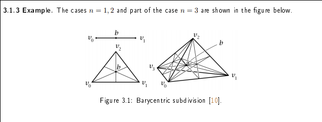
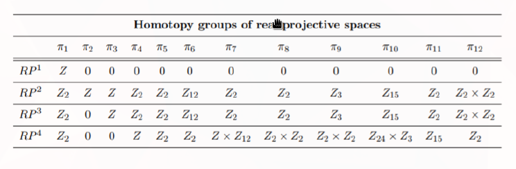
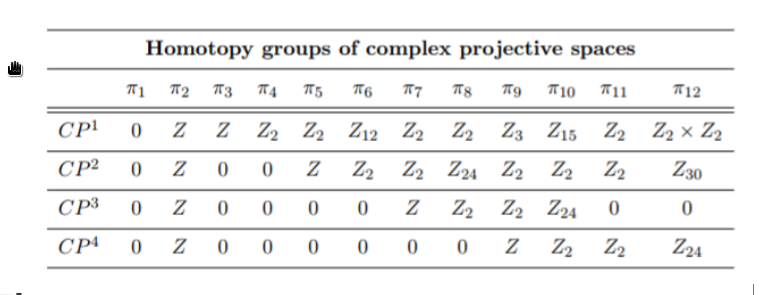
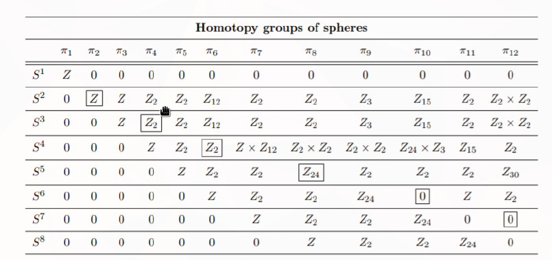
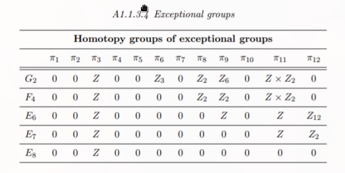

# Higher homotopy and further topics

## Homotopy groups of classical groups

::: {.fact title="Bott periodicity in the stable range"}
For $k$ in the stable range ($k\leq 2n-1$ for $U(n)$, $k\leq n-2$ for $O(n)$, $k\leq 4n$ for $Sp(n)$),
$$
\begin{aligned}
\pi_k(U(n)) &\cong \begin{cases} \ZZ & k \text{ odd}, \\ 0 & k \text{ even}, \end{cases} \\
\pi_k(O(n)) &\cong \begin{cases} \ZZ/2 & k\equiv 0,1 \pmod 8, \\ \ZZ & k\equiv 3,7 \pmod 8, \\ 0 & \text{otherwise}, \end{cases} \\
\pi_k(Sp(n)) &\cong \begin{cases} \ZZ & k\equiv 3,7 \pmod 8, \\ \ZZ/2 & k\equiv 4,5 \pmod 8, \\ 0 & \text{otherwise}. \end{cases}
\end{aligned}
$$
The inclusion $SU(n)\injects U(n)$ induces isomorphisms on $\pi_k$ for $k\geq 2$, and $\pi_1(U(n))\cong\ZZ$ via the determinant while $\pi_1(SU(n))=1$.

:::

::: {.fact title="Groups and group actions"}
\envlist

- For a discrete topological group $G$, $\pi_0(G) = G$ as sets.
- For a closed subgroup $H$ of a Lie group $G$, the fibration $H\to G\to G/H$ gives $\pi_k(G/H)\cong\pi_k(G)$ whenever $\pi_k(H) = \pi_{k-1}(H) = 0$.
- If $X$ is simply connected and a discrete group $G$ acts on $X$ freely and properly discontinuously, then $\pi_1(X/G)\cong G$.

:::

## Cup and cap products

::: {.definition title="Cup and cap products"}
For a space $X$, a ring $R$, cochains $\varphi\in C^p(X;R)$ and $\psi\in C^q(X;R)$, and a singular simplex $\sigma\colon\Delta^{p+q}\to X$, the \dfn{cup product} $\varphi\cup\psi\in C^{p+q}(X;R)$ is
$$
(\varphi \cup \psi)(\sigma) \coloneqq \varphi\bigl(\sigma|_{[v_0,\ldots,v_p]}\bigr)\, \psi\bigl(\sigma|_{[v_p,\ldots,v_{p+q}]}\bigr),
$$
the product of $\varphi$ on the front $p$-face and $\psi$ on the back $q$-face.
For $\sigma\colon\Delta^{k}\to X$ with $k\geq p$, the \dfn{cap product} $\sigma\cap\varphi\in C_{k-p}(X;R)$ is
$$
\sigma \cap \varphi \coloneqq \varphi\bigl(\sigma|_{[v_0,\ldots,v_p]}\bigr)\, \sigma|_{[v_p,\ldots,v_k]}.
$$

:::

::: {.fact}
\envlist

- $\delta(\varphi\cup\psi) = \delta\varphi\cup\psi + (-1)^p\,\varphi\cup\delta\psi$, so $\cup$ induces $H^p(X;R)\times H^q(X;R)\to H^{p+q}(X;R)$, and $\cap$ induces $H_k(X;R)\times H^p(X;R)\to H_{k-p}(X;R)$.
- For continuous $f\colon X\to Y$, $f^*(a\cup b) = f^*a \cup f^*b$.
- For $\varphi\in C^p$, $\psi\in C^q$, and $\sigma\colon\Delta^{p+q}\to X$, $\psi(\sigma \cap \varphi) = (\varphi \cup \psi)(\sigma)$, that is, $\inner{\varphi\cup \psi}{\sigma} = \inner{\psi}{\sigma \cap \varphi}$.

:::

::: {.proposition title="Cup product is dual to transverse intersection"}
Let $M$ be a closed oriented smooth $n$-manifold, and let $A, B \subseteq M$ be closed oriented submanifolds of codimensions $i$ and $j$ that intersect transversely: for every $p\in A\intersect B$, the map $T_pA \oplus T_p B \to T_p M$ is surjective.
Then $A\intersect B$ is a submanifold of codimension $i+j$, oriented by the exact sequence
$$
0 \to T_p(A\intersect B) \to T_p A \oplus T_p B \to T_p M \to 0.
$$
Let $[A]\in H_{n-i}(M)$, $[B]\in H_{n-j}(M)$, and $[A\intersect B]\in H_{n-i-j}(M)$ be the images of the fundamental classes under inclusion, and $[A]\dual\in H^i(M)$, $[B]\dual\in H^j(M)$, $[A\intersect B]\dual\in H^{i+j}(M)$ their Poincaré duals.
Then
$$
[A]\dual \cup [B]\dual = [A\intersect B]\dual.
$$

:::

::: {.example title="$\CP^n$"}
For $0\leq i\leq n$, $H^{2i}(\CP^n)\cong\ZZ$ is generated by the Poincaré dual $\alpha_i$ of a linear subspace $\CP^{n-i}$ of complex codimension $i$.
Generic linear subspaces of codimensions $i$ and $j$ meet transversely in a linear subspace of codimension $i+j$, so $\alpha_i \cup \alpha_j = \alpha_{i+j}$ for $i+j \leq n$.

:::

::: {.example title="$T^2$"}
$H_1(T^2) \cong\ZZ^2$ is generated by the classes $[A], [B]$ of a longitude and a meridian, and $H_0(T^2) \cong \ZZ$ by the class $[p]$ of a point.
$A$ and $B$ meet transversely in one point, with sign determined by the orientations, so $[A]\dual \cup [B]\dual = \pm[p]\dual$ and $[B]\dual \cup [A]\dual = -[A]\dual \cup [B]\dual$.

:::

## The long exact sequence of a pair

::: {.theorem}
For a space $A$ and a subspace $B\subseteq A$, the short exact sequence of chain complexes $0\to C_*(B)\to C_*(A)\to C_*(A,B)\to 0$ induces a long exact sequence
$$
\cdots \to H_n(B) \to H_n(A) \to H_n(A,B) \xrightarrow{\ \del\ } H_{n-1}(B) \to \cdots.
$$

:::

## Tables

## Higher homotopy

::: {.fact}
\envlist

- For $n \geq 2$, $\pi_n(X)$ is abelian.
- $\Sigma S^n \cong S^{n+1}$.
- For pointed spaces, $[\Sigma X, Y]_* \cong [X, \Omega Y]_*$, hence $[\Sigma^n X, Y]_* \cong [X, \Omega^n Y]_*$.
- $\pi_n(\Omega X) \cong \pi_{n+1}(X)$, and $\pi_n(X) \cong \pi_0(\Omega^n X)$.
- For $n\geq 2$, $\pi_n(S^1) = 0$, since the universal cover $\RR$ is contractible.
- For $k < n$, $\pi_k(S^n) = 0$.
- A map $f\colon S^n \to X$ extends to $D^{n+1}$ if and only if $f$ is homotopic to a constant map.
- **Hurewicz.** If $X$ is path connected and $\pi_k(X)=0$ for all $k<n$, with $n\geq 2$, then $\tilde H_k(X)=0$ for $k<n$ and $\pi_n(X) \cong H_n(X)$; for $n=1$, $H_1(X)$ is the abelianization of $\pi_1(X)$.
- **Freudenthal suspension.** For $k \leq 2n-2$, suspension induces an isomorphism $\pi_k(S^n) \cong \pi_{k+1}(S^{n+1})$, and a surjection for $k=2n-1$; the common value of $\pi_{n+m}(S^n)$ for $n>m+1$ is the stable homotopy group $\pi_m^s$.
- A fibration $F\to E \to B$ with $B$ path connected yields a long exact sequence $\cdots\to\pi_n(F) \to \pi_n(E) \to \pi_n(B) \to \pi_{n-1}(F) \to \cdots$.
- Applying $\Omega$ to a fibration $F\to E\to B$ gives a fibration $\Omega F\to\Omega E\to\Omega B$.

:::

## Homotopy groups of spheres

::: {.fact}
\envlist

- $\pi_n(S^n) \cong \ZZ$ for $n\geq 1$.
- $\pi_3(S^2) \cong \ZZ$, and $\pi_k(S^2) \cong \pi_k(S^3)$ for $k\geq 3$ by the Hopf fibration.
- $\pi_{n+1}(S^n) \cong \ZZ/2$ for $n \geq 3$, and $\pi_4(S^2)\cong\ZZ/2$.
- $\pi_{n+2}(S^n) \cong \ZZ/2$ for $n\geq 2$.
- $\pi_{n+3}(S^n) \cong \ZZ/24$ for $n\geq 5$, $\pi_6(S^3)\cong\ZZ/12$, and $\pi_7(S^4) \cong \ZZ \oplus \ZZ/12$.

:::

## Building a Moore space

::: {.example}
For $n\geq 1$ and $p\geq 2$, attaching an $(n+1)$-cell to $S^n$ along a map $\del D^{n+1}\to S^n$ of degree $p$ gives a Moore space $M(\ZZ/p, n)$.
For finitely many abelian groups $G_i$ with Moore spaces $X_i=M(G_i,n)$, the wedge $\bigvee_i X_i$ is an $M(\bigoplus_i G_i, n)$.
By the Mayer--Vietoris sequence, $\tilde H_{n+1}(\Sigma X) \cong \tilde H_n(X)$, so $\Sigma M(G,n)$ is an $M(G,n+1)$.

:::
